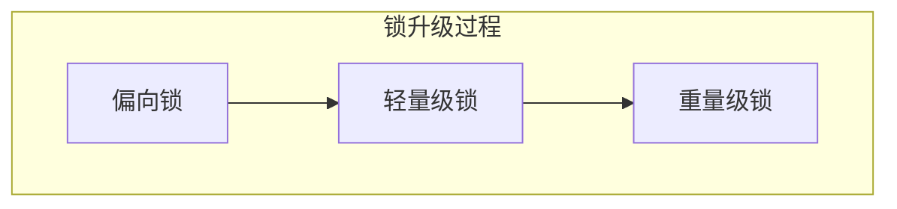

# Java 并发常见问题


[[toc]]


这里简略回答，详细自行查找


## 创建线程池的方式

1. 继承 `Thread` 类
2. 实现 `Runnable` 接口
3. 实现 `Callable<T>` 接口，配合 `FutureTask<V>` 类
4. 线程池创建


## 为什么不建议使用 Executors 创建线程池？

底层使用 `ThreadPoolExecutor` 创建，其中 `LinkedBlockingQueue<Runnable>()` 是一个==无界阻塞队列==，任务过多时会不断将任务添加到队列中，最终可能耗尽内存，==导致 OOM==

```java
public static ExecutorService newFixedThreadPool(int nThreads) {
    return new ThreadPoolExecutor(nThreads, nThreads,
                                  0L, TimeUnit.MILLISECONDS,
                                  new LinkedBlockingQueue<Runnable>());
}
```

同样地，使用其他的例如 `Executors.newSingleThreadExecutor`，也会有相同问题

```java
public static ExecutorService newSingleThreadExecutor() {
    return new FinalizableDelegatedExecutorService
        (new ThreadPoolExecutor(1, 1,
                                0L, TimeUnit.MILLISECONDS,
                                new LinkedBlockingQueue<Runnable>()));
}
```

在实际生产中更建议直接使用 `ThreadPoolExecutor` 定义线程池，这样可以更加灵活地控制


## 线程池的状态

1. RUNNING
2. SHUTDOWN
3. STOP
4. TIDYING
5. TERMINATED


## Sychronized 和 ReentrantLock 的不同点

| Sychronized                      | ReentrantLock                       |
| -------------------------------- | ----------------------------------- |
| Java 中的关键字                  | JDK 提供的类                        |
| 自动加锁和自动释放锁             | 需要手动加锁和手动释放锁            |
| JVM 层面的锁                     | API 层面的锁                        |
| 非公平锁                         | 公平锁或非公平锁                    |
| 锁的是对象，锁信息保存在对象头中 | int 类型的 state 标识来标识锁的状态 |
| 底层有锁升级                     | 没有锁升级过程                      |


## ThreadLocal 有哪些应用场景？底层如何实现？

Java 中提供的==线程本地存储机制==，可以利用该机制==将数据缓存在某个线程内部==，该线程可以在任意时刻、任意方法中获取缓存的数据

底层是通过 `ThreadLocalMap` 实现的，key 为 `ThreadLocal` 对象，value 是需要缓存的值：

```java
/* ThreadLocal values pertaining to this thread. This map is maintained
 * by the ThreadLocal class. */
ThreadLocal.ThreadLocalMap threadLocals = null;
```

但是注意：如果在线程池中使用  `ThreadLocal`  会造成内存泄露，因为线程池不会回收  `ThreadLocal`  对象的 `Entry` 对象。并且线程对象是通过强引用指向 `ThreadLocalMap` 的，而 `ThreadLocalMap`  是通过强引用指向  `Entry` 对象的，这样只要线程不被回收， `Entry` 对象就不会被回收，从而导致==内存泄露==

解决方案：使用了 `ThreadLocal` 对象后手动调用 `remove()` 方法，手动清除 `Entry` 对象

 `ThreadLocal`  经典的应用场景就是 **连接管理**，即一个线程持有一个连接，该连接对象可以在不同的方法之间进行 **传递**，而线程之间不共享同一个连接


## ReentrantLock 分为公平锁和非公平锁，底层分别怎么实现？

两种的底层==都是使用 AQS 进行排队==，区别在于线程加锁时：

1. 如果是公平锁，会先检查 AQS 队列是否存在线程在排队，如果有线程在排队，那么当前线程也排队
2. 如果是非公平锁，不会检查是否排队，而是会直接竞争锁

所以，两种锁一旦没有竞争到锁，都会进行排队，当锁释放时，都是唤醒排在最前面的锁

非公平锁知识体现在了线程加锁阶段，而没有体现在线程唤醒阶段

**注意：ReentrantLock 是可重入锁，不管是公平锁还是非公平锁都是可重入的**


## Reentrantlock 中的 tryLock 和 lock 方法的区别

1. `tryLock()` 表示尝试加锁，可以加上锁也可能加不上，**该方法不会阻塞线程**，如果获取到锁就返回 `true`，否则返回 `false`
2. `lock()` 表示 **阻塞加锁**，线程会阻塞直到加上锁，该方法没有返回值


## Sychronized 的锁升级过程



1. 偏向锁：锁对象的对象头中获取线程 ID，该线程下次如果又来获取该锁就可以直接获取到，也就是支持锁重入
2. 轻量级锁：当一个线程获取到锁后，先是称为偏向锁，如果有第二个线程来竞争，就升级成轻量级锁，底层是由自旋来实现的，**不会阻塞线程**
3. 重量级锁：如果自旋次数过多还没有获取锁，则会升级成重量级锁，重量级锁会导致线程阻塞

自旋锁通过自旋不阻塞线程，也就无所谓唤醒线程。自旋锁是线程通过 CAS 获取预取的标记，如果没有获取到就会循环获取，因此线程是在一直运行着的，但是相对阻塞来说还是比较轻量的

阻塞和唤醒这两个步骤都是需要 **操纵系统** 进行操作的，比较消耗时间


## 说说对线程安全的理解

线程安全一般是指我们写的某段代码，在多个线程同时执行的情况下也能有正常的结果，即不会混乱

比如执行 `i++` ，初始值为 0，如果线程安全那么线程一和线程二同时执行后结果应当是，一个线程为 `i=1`；另一个 `i=2`，如果不是这样的结果说明线程不安全


## 说说对守护线程的理解

- 线程分为 **用户线程** 和 **守护线程**
- 用户线程就是普通线程；守护线程就是 JVM 的后台线程
- 比如垃圾回收线程就是一个守护线程，守护线程会在其他普通线程都停止运行之后自动关闭
- 可以通过 `thread.setDaemon(true)` 来把一个线程设置成守护线程


## 并发、并行、串行之间的区别

1. 串行：一个任务执行完才能执行下一个任务
2. 并行：两个任何同时执行
3. 并发：两个任务整体开上去是同时执行的，但是在底层是被切分成了很多份，然后在不同的时间片执行不同的部分，这样处理起来在整体上就像同时发生的


## Java 死锁如何避免

**造成死锁的几个原因：**

1. 一个资源每次只能被一个线程使用
2. 一个线程在阻塞等待某个资源时，不是放已经占有的资源
3. 一个线程已经获取了资源，在未使用完之前不能被强行剥夺
4. 若干线程形成头尾相接的循环等待资源关系

前三个条件是 **锁必须满足的条件**，要避免死锁就要打破第 4 个条件，即不出现循环等待的情况

**具体开发中就是：**

1. 要注意加锁顺序：保证每个线程按同样的顺序加锁
2. 要注意加锁时限：可以针对锁设置一个 **超时时间**
3. 要注意死锁检查：这是一种预防机制，确保在第一时间发现死锁并解决


## 线程池的底层工作原理

当线程池中的核心线程都在忙时，如果继续往线程池中添加任务，那么这个任务就放入队列，队列满了之后，才会新开线程

线程池内部时通过「队列」+「线程」实现的，当利用线程池执行任务时：

1. 线程数量小于 `corePoolSize` 时，即使线程池中的线程都处于空闲状态，也要创建新的线程来处理被添加的任务
2. 线程数量等于 `corePoolSize` 时，如果缓冲队列 `workQueue` 未满，那么任务会被放进缓冲队列
3. 线程数量大于 `corePoolSize` 时，如果缓冲队列 `workQueue` 已满，并且线程池中的数量小于 `maximunPoolSize`，那么就建立新的线程来处理此任务
4. 线程数量大于 `corePoolSize` 时，如果缓冲队列 `workQueue` 已满，并且线程池中的数量等于 `maximunPoolSize`，那么通过 `handler` 所指定的策略来处理此任务
5. 线程数量大于 `corePoolSize` 时，如果某线程空闲时间超过 `keepAliveTime`，线程将被终止。这样，线程池可以动态动态地调整池中的线程数


## CountDownLatch 和 Semaphore 的区别和底层原理

`CountDownLatch`和`Semaphore`都是Java中用于控制线程同步的工具类，它们的作用都是控制并发线程的数量，但是它们的实现方式和应用场景有所不同。

### CountDownLatch

`CountDownLatch`是一个计数器，它的作用是让一个或多个线程等待一个或多个线程完成操作，然后再继续执行。它的实现原理是一个线程等待多个线程的信号，当多个线程完成某项任务时，计数器减1，当计数器减为0时，等待的线程就可以继续执行了。

下面是一个简单的`CountDownLatch`示例：

```java
javaCopy codeimport java.util.concurrent.CountDownLatch;

public class CountDownLatchDemo {

    public static void main(String[] args) throws InterruptedException {
        int count = 5;
        CountDownLatch latch = new CountDownLatch(count);

        for (int i = 0; i < count; i++) {
            new Thread(() -> {
                try {
                    // 模拟耗时操作
                    Thread.sleep(1000);
                    System.out.println(Thread.currentThread().getName() + "执行完成");
                } catch (InterruptedException e) {
                    e.printStackTrace();
                } finally {
                    latch.countDown();
                }
            }, "Thread-" + i).start();
        }

        System.out.println("等待" + count + "个线程执行完成");
        latch.await();
        System.out.println("所有线程执行完成");
    }
}
```

在上面的示例中，创建了5个线程模拟耗时操作，等待所有线程执行完成之后输出“所有线程执行完成”。

### Semaphore

`Semaphore`是一个信号量，它的作用是控制同时访问某个资源的线程数量。例如，一个数据库连接池可以使用`Semaphore`来限制访问数据库的线程数量。

`Semaphore`的实现原理是，它维护了一个许可证的数量，线程需要获取许可证才能访问资源。当线程访问资源完成之后，需要释放许可证，许可证数量加1。

下面是一个简单的`Semaphore`示例：

```java
javaCopy codeimport java.util.concurrent.Semaphore;

public class SemaphoreDemo {

    public static void main(String[] args) {
        int threadCount = 10;
        Semaphore semaphore = new Semaphore(5);

        for (int i = 0; i < threadCount; i++) {
            new Thread(() -> {
                try {
                    semaphore.acquire();
                    System.out.println(Thread.currentThread().getName() + "获取到许可证");
                    Thread.sleep(1000);
                    System.out.println(Thread.currentThread().getName() + "释放许可证");
                    semaphore.release();
                } catch (InterruptedException e) {
                    e.printStackTrace();
                }
            }, "Thread-" + i).start();
        }
    }
}
```

在上面的示例中，创建了10个线程，但是`Semaphore`的许可证数量只有5个。因此，只有5个线程能够获取到许可证并执行操作，其它线程需要等待许可证被释放之后才能


## 其他

1. [Future and FutureTask](https://www.geeksforgeeks.org/future-and-futuretask-in-java/)


