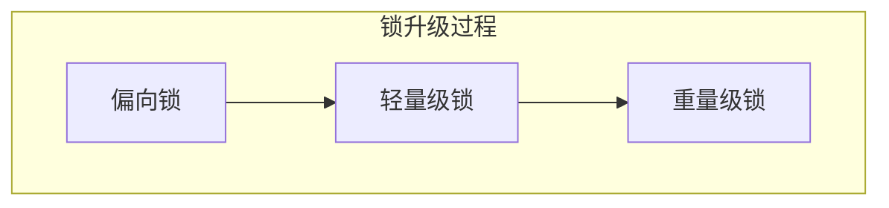

# Java 并发面试常见问题

这里简略回答，详细自行查找


## 创建线程池的方式

1. 继承 `Thread` 类
2. 实现 `Runnable` 接口
3. 实现 `Callable<T>` 接口，配合 `FutureTask<V>` 类
4. 线程池创建


## 为什么不建议使用 Executors 创建线程池？

底层使用 `ThreadPoolExecutor` 创建，其中 `LinkedBlockingQueue<Runnable>()` 是一个==无界阻塞队列==，任务过多时会不断将任务添加到队列中，最终可能耗尽内存，==导致 OOM==

```java
public static ExecutorService newFixedThreadPool(int nThreads) {
    return new ThreadPoolExecutor(nThreads, nThreads,
                                  0L, TimeUnit.MILLISECONDS,
                                  new LinkedBlockingQueue<Runnable>());
}
```

同样地，使用其他的例如 `Executors.newSingleThreadExecutor`，也会有相同问题

```java
public static ExecutorService newSingleThreadExecutor() {
    return new FinalizableDelegatedExecutorService
        (new ThreadPoolExecutor(1, 1,
                                0L, TimeUnit.MILLISECONDS,
                                new LinkedBlockingQueue<Runnable>()));
}
```

在实际生产中更建议直接使用 `ThreadPoolExecutor` 定义线程池，这样可以更加灵活地控制


## 线程池的状态

1. RUNNING
2. SHUTDOWN
3. STOP
4. TIDYING
5. TERMINATED


## Sychronized 和 ReentrantLock 的不同点

| Sychronized                      | ReentrantLock                       |
| -------------------------------- | ----------------------------------- |
| Java 中的关键字                  | JDK 提供的类                        |
| 自动加锁和自动释放锁             | 需要手动加锁和手动释放锁            |
| JVM 层面的锁                     | API 层面的锁                        |
| 非公平锁                         | 公平锁或非公平锁                    |
| 锁的是对象，锁信息保存在对象头中 | int 类型的 state 标识来标识锁的状态 |
| 底层有锁升级                     | 没有锁升级过程                      |


## ThreadLocal 有哪些应用场景？底层如何实现？

Java 中提供的==线程本地存储机制==，可以利用该机制==将数据缓存在某个线程内部==，该线程可以在任意时刻、任意方法中获取缓存的数据

底层是通过 `ThreadLocalMap` 实现的，key 为 `ThreadLocal` 对象，value 是需要缓存的值：

```java
/* ThreadLocal values pertaining to this thread. This map is maintained
 * by the ThreadLocal class. */
ThreadLocal.ThreadLocalMap threadLocals = null;
```

但是注意：如果在线程池中使用  `ThreadLocal`  会造成内存泄露，因为线程池不会回收  `ThreadLocal`  对象的 `Entry` 对象。并且线程对象是通过强引用指向 `ThreadLocalMap` 的，而 `ThreadLocalMap`  是通过强引用指向  `Entry` 对象的，这样只要线程不被回收， `Entry` 对象就不会被回收，从而导致==内存泄露==

解决方案：使用了 `ThreadLocal` 对象后手动调用 `remove()` 方法，手动清除 `Entry` 对象

 `ThreadLocal`  经典的应用场景就是 **连接管理**，即一个线程持有一个连接，该连接对象可以在不同的方法之间进行 **传递**，而线程之间不共享同一个连接


## ReentrantLock 分为公平锁和非公平锁，底层分别怎么实现？

两种的底层==都是使用 AQS 进行排队==，区别在于线程加锁时：

1. 如果是公平锁，会先检查 AQS 队列是否存在线程在排队，如果有线程在排队，那么当前线程也排队
2. 如果是非公平锁，不会检查是否排队，而是会直接竞争锁

所以，两种锁一旦没有竞争到锁，都会进行排队，当锁释放时，都是唤醒排在最前面的锁

非公平锁知识体现在了线程加锁阶段，而没有体现在线程唤醒阶段

**注意：ReentrantLock 是可重入锁，不管是公平锁还是非公平锁都是可重入的**


## Sychronized 的锁升级过程



1. 偏向锁：锁对象的对象头中获取线程 ID，该线程下次如果又来获取该锁就可以直接获取到，也就是支持锁重入
2. 轻量级锁：当一个线程获取到锁后，先是称为偏向锁，如果有第二个线程来竞争，就升级成轻量级锁，底层是由自旋来实现的，**不会阻塞线程**
3. 重量级锁：如果自旋次数过多还没有获取锁，则会升级成重量级锁，重量级锁会导致线程阻塞

自旋锁通过自旋不阻塞线程，也就无所谓唤醒线程。自旋锁是线程通过 CAS 获取预取的标记，如果没有获取到就会循环获取，因此线程是在一直运行着的，但是相对阻塞来说还是比较轻量的

阻塞和唤醒这两个步骤都是需要 **操纵系统** 进行操作的，比较消耗时间


