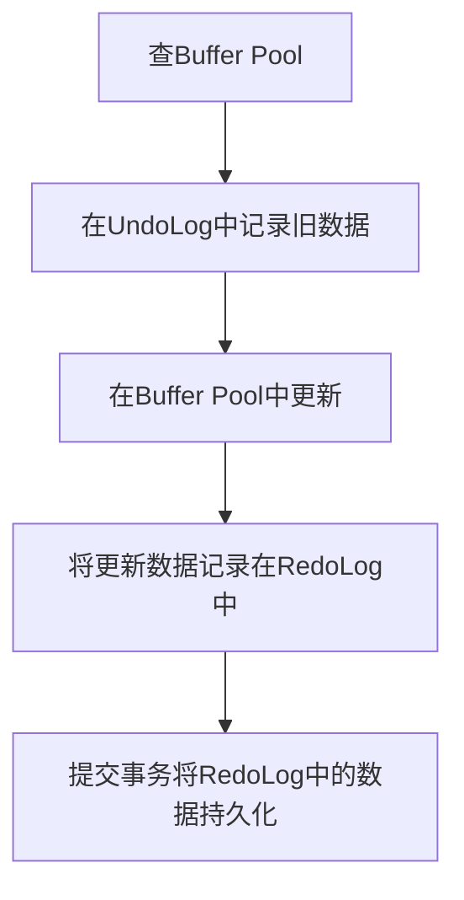

# MySQL 原理

[[toc]]


## 工作原理

1. MySQL 是使用 C/C++ 写的

2. 对于数据库而言，重要的不是数据量，而是当数据量增加时运算如何增加

3. MySQL 中的 sort 使用的是「归并排序」

4. 二叉搜索树是查询的关键，MySQL 中使用的是 B+ 树（索引）：

   ​	查找一个特定值这个树挺好用，但是当你需要**查找两个值之间的多个元素**时，就会有大麻烦了。你的成本将是 O(N)，因为你必须查找树的每一个节点，以判断它是否处于那 2 个值之间（例如，对树使用中序遍历）。而且这个操作不是磁盘I/O有利的，因为你必须读取整个树。我们需要找到高效的范围查询方法

5. 数据库一般需要：
   1. 核心组件
   2. 管理工具
   3. 查询管理器
      - 查询解析器：检查语法、语序、权限是否正确
      - 查询重写器：预优化查询、避免不必要的运算、帮助优化器找到合理的最佳方案
      - 统计：避免浪费资源
      - 查询优化器：所有的现代数据库都在用**基于成本的优化**（即CBO）来优化查询。道理是针对每个运算设置一个成本，通过应用成本最低廉的一系列运算，来找到最佳的降低查询成本的方法
      - 查询执行器
   4. 数据管理器
      - 缓存管理器：避免 I/O 瓶颈，还会进行预读，多数现代数据库(至少 SQL Server, MySQL, Oracle 和 DB2)使用 LRU 算法作为缓冲区置换策略
      - 事务管理器
      - 并发控制
      - 锁管理器
      - 日志管理器


大多时候瓶颈都在于磁盘 I/O 而不是 CPU

仅供参考：还有其他类型的索引，比如位图索引，在 CPU、磁盘I/O、和内存方面与B+树索引的成本并不相同。

另外，很多现代数据库为了改善执行计划的成本，可以仅为当前查询动态地生成临时索引。


数据库的扫描方式：

1. 全表扫描
2. 范围扫描
3. 唯一扫描
4. 根据 ROW ID 存取


常用的联接操作：

> **联接的类型**：是等值联接（比如 tableA.col1 = tableB.col2 ）？ 还是内联接？外联接？笛卡尔乘积？或者自联接？有些联接在特定环境下是无法工作的。

1. 嵌套循环联接（大表联接小表较快，如果两表都大那么 CPU 成本较高）
2. 哈希连接（需要较大内存）
3. 合并联接（唯一产生排序的联接，如果结果需要排序或者有索引的话就是很好的选择）


算法：

对于小规模的查询，采取粗暴的方式是有可能的。但是为了让中等规模的查询也能采取粗暴的方式，我们有办法避免不必要的计算，这就是动态规划

优化器面对一个非常大的查询，或者为了尽快找到答案（然而查询速度就快不起来了），会应用另一种算法，叫贪婪算法


查询计划缓存：

由于创建查询计划是耗时的，大多数据库把计划保存在查询计划缓存，来避免重复计算。这个话题比较大，因为数据库需要知道什么时候更新过时的计划。办法是设置一个上限，如果一个表的统计变化超过了上限，关于该表的查询计划就从缓存中清除


查询执行：

在这个阶段，我们有了一个优化的执行计划，再编译为可执行代码。然后，如果有足够资源（内存，CPU），查询执行器就会执行它。计划中的操作符 (JOIN, SORT BY …) 可以顺序或并行执行，这取决于执行器。为了获得和写入数据，查询执行器与数据管理器交互，本文下一部分来讨论数据管理器


## 数据库设计流程

1. **需求分析**：分析用户的需求，包括数据、功能和性能需求；
2. **概念结构设计**：主要采用E-R模型进行设计，包括画E-R图；
3. **逻辑结构设计**：通过将E-R图转换成表，实现从E-R模型到关系模型的转换；
4. **数据库物理设计**：主要是为所设计的数据库选择合适的存储结构和存取路径；
5. **数据库的实施**：包括编程、测试和试运行；
6. **数据库运行与维护**：系统的运行与数据库的日常维护


## 核心知识点

MySQL 默认采用自动提交模式。也就是说，如果不显式使用`START TRANSACTION`语句来开始一个事务，那么每个查询都会被当做一个事务自动提交

封锁粒度：MySQL 中提供了两种封锁粒度: 行级锁以及表级锁

封锁类型：

- 读写锁：排他锁（X 锁，写锁）；共享锁（S 锁，读锁）
- 意向锁：在原来的 X/S 锁之上引入了 IX/IS，IX/IS 都是表锁，用来表示一个事务想要在表中的某个数据行上加 X 锁或 S 锁。有以下两个规定

规定：

一个事务对数据对象 A 加了 X 锁，就可以对 A 进行读取和更新。加锁期间其它事务不能对 A 加任何锁

一个事务对数据对象 A 加了 S 锁，可以对 A 进行读取操作，但是不能进行更新操作。加锁期间其它事务能对 A 加 S 锁，但是不能加 X 锁

一个事务在获得某个数据行对象的 S 锁之前，必须先获得表的 IS 锁或者更强的锁

一个事务在获得某个数据行对象的 X 锁之前，必须先获得表的 IX 锁

任意 IS/IX 锁之间都是兼容的，因为它们只是表示想要对表加锁，而不是真正加锁

S 锁只与 S 锁和 IS 锁兼容，也就是说事务 T 想要对数据行加 S 锁，其它事务可以已经获得对表或者表中的行的 S 锁

封锁协议：

1. 三级封锁协议
2. 两段锁协议

隐式与显示锁定（MySQL 的 InnoDB 存储引擎采用两段锁协议，会根据隔离级别在需要的时候自动加锁，并且所有的锁都是在同一时刻被释放，这被称为隐式锁定），可以通过特定语句进行显示锁定


## SQL 优化

- 负向查询不能使用索引
- 前导模糊查询不能使用索引（建议可以考虑使用 `Lucene` 等全文索引工具来代替频繁的模糊查询）
- 数据区分不明显的不建议创建索引
- 字段的默认值不要为 null
- 在字段上进行计算是不能命中索引的
- 复合索引的最左前缀单独使用才可以命中索引（全部使用也可以）
- 如果明确最终只有一条记录返回，可以在查询语句最后加上 `limit 1`，可以提高效率，可以让数据库停止游标移动
- 数据库层面做类型转换可能会导致全表扫描，查询时一定要使用正确的类型
- 进行 join 的字段，两表中的字段类型不相同是不会命中索引的


## MVCC 

MVCC（Multi-Version Concurrency Control，多版本并发控制）是一种常见的数据库并发控制机制，它可以同时支持高并发性和数据一致性。

MVCC的主要思想是为每个事务维护多个版本的数据副本，并根据事务的隔离级别来决定读取哪个版本的数据。当一个事务读取数据时，它可以根据自己的事务ID（或时间戳）来选择一个合适的数据版本。当事务进行写操作时，会根据实际情况来创建一个新的数据版本。

MVCC机制的优点是它可以大大减少锁的使用，从而提高并发性能和可伸缩性，同时也可以保证数据的一致性。不同的数据库实现MVCC的方式可能略有不同，但是通常都会使用一些共同的技术，如多版本数据结构、回滚段、快照等。

在实际应用中，MVCC常被用于实现数据库中的事务隔离级别，如READ COMMITTED、REPEATABLE READ等级别。在这些隔离级别下，MVCC可以避免一些常见的并发问题，如脏读、不可重复读和幻读等。

需要注意的是，MVCC机制虽然可以提高数据库的并发性和可伸缩性，但也会增加数据库的存储开销，因为需要为每个事务维护多个数据版本。因此，在实际应用中，需要根据具体的业务场景和数据库的负载情况来选择合适的并发控制机制。


## MyISAM 和 InnoBD 的区别

MyISAM和InnoDB都是MySQL中常用的存储引擎，它们在很多方面都有不同的特点。

1. 数据安全性方面：MyISAM和InnoDB采用不同的方式进行数据存储和索引管理。MyISAM不支持事务处理和行级锁定，只能对整个表进行加锁，这就使得MyISAM在并发访问时容易发生锁冲突和数据不一致问题。而InnoDB支持事务处理和行级锁定，可以提供更高的数据安全性和并发性能。
2. 数据处理效率方面：MyISAM和InnoDB在数据处理效率方面也有不同的特点。MyISAM在读取静态数据时比较快，而InnoDB则在读取动态数据时表现更出色。此外，MyISAM对于频繁的插入和查询操作也表现较好，而InnoDB则更适合对事务处理和数据完整性要求较高的应用场景。
3. 数据完整性方面：MyISAM和InnoDB在数据完整性方面也有不同的特点。MyISAM不支持外键约束和事务处理，数据完整性往往需要在应用程序中进行处理。而InnoDB支持外键约束和事务处理，可以在数据库层面保证数据的完整性。
4. 空间占用方面：MyISAM和InnoDB在空间占用方面也有不同的特点。MyISAM对于大量的静态数据存储比较高效，而InnoDB则在处理大量动态数据和索引时表现更出色。

总的来说，MyISAM和InnoDB各有优缺点，在实际应用中需要根据具体的业务需求和数据特点来选择合适的存储引擎。对于需要事务处理和数据完整性保证的应用，推荐使用InnoDB存储引擎。对于静态数据量较大的应用，则可以考虑使用MyISAM存储引擎。同时，MySQL也支持将不同的表使用不同的存储引擎，可以根据具体的需求来做出选择。

<br/>

MyISAM和InnoDB在存储结构上也有一些不同：

1. MyISAM存储结构：MyISAM将数据和索引分别存储在两个文件中，分别为.MYD和.MYI文件。.MYD文件存储数据，.MYI文件存储索引。MyISAM采用B+树索引结构，每个索引节点都包含一个索引值和一个指向下一个节点的指针，叶子节点包含了指向实际数据记录的指针。
2. InnoDB存储结构：InnoDB将数据和索引存储在同一个文件中，称为表空间。InnoDB采用了类似于B+树的结构，每个索引节点包含一个索引值和一个指向下一个节点的指针，叶子节点包含了实际的数据记录。与MyISAM不同的是，InnoDB的索引节点和数据节点都存储在同一个B+树上，因此可以支持更高效的数据查询和事务处理。

总的来说，MyISAM和InnoDB的存储结构有所不同，这也导致了它们在数据处理效率、数据安全性和空间利用率等方面表现不同。在选择存储引擎时，需要根据实际的业务需求和数据特点来进行选择。


## 数据库连接池

> 数据库连接池避免了每来一个请求就新建一次连接，而是维护一定的连接数方便系统获取连接，我们不需要关心连接的创建和销毁以及连接是怎么建立的

常见的数据库连接池有：

1. Druid
2. C3P0
3. DBCP


## 存储引擎

SQL 的解析操作和优化都必须通过执行器调用 **存储引擎** 接口才能够被执行

注：对索引的处理也是在存储引擎中进行的

重要组件：

1. Buffer Pool 缓冲池：将磁盘数据加载到内存中
2. UndoLog 日志文件：记录修改前的状态以便回滚
3. RedoLog Buffer：记录修改后的状态以便持久化

执行步骤：




## MySQL 级日志文件

> redo log是 InnoDB 存储引擎特有的日志文件，而bin log属于是 MySQL 级别的日志。redo log记录的东西是偏向于物理性质的，如：“对什么数据，做了什么修改”。bin log是偏向于逻辑性质的，类似于：“对 students 表中的 id 为 1 的记录做了更新操作” — [Java 全栈知识体系](https://www.pdai.tech/md/db/sql-mysql/sql-mysql-execute.html)

bin log 记录的是整个操作记录，是 MySQL 级别的，所有存储引擎都可以使用（redo log 是记录数据操作后的状态，且是 Innodb 存储引擎特有的）

bin log 的刷入模式：

1. STATMENT：每一条 **修改数据的 SQL** 都记录
2. ROW：只记录哪条数据被修改，不记录每条 SQL 的上下文信息
3. MIXED：混合模式

注：数据修改写入 redo log 时也会写入 bin log


## SQL 解析

SQL 解析与优化属于编辑器范畴，包括以下内容：

1. 词法分析（MySQLLex）
2. 语法分析（Bison 生成）
3. 查询优化
4. 执行语句


## ACID 靠什么保证的？

1. 原子性由undo log日志保证，它记录了需要回滚的日志信息，事务回滚时撤销已经执行成功的sql

2. 一致性由其他三大特性保证、程序代码要保证业务上的一致性
3. 隔离性由MVCC来保证
4. 持久性由内存+redo log来保证，mysql修改数据同时在内存和redo log记录这次操作，宕机的时候可以从redo log恢复


## mysql 主从同步原理

mysql主从同步的过程：

Mysql的主从复制中主要有三个线程： master（binlog dump thread）、slave（I/O thread 、SQL thread） ，Master一条线程和Slave中的两条线程。

主节点 binlog，主从复制的基础是主库记录数据库的所有变更记录到 binlog。binlog 是数据库服务器启动的那一刻起，保存所有修改数据库结构或内容的一个文件。

主节点 log dump 线程，当 binlog 有变动时，log dump 线程读取其内容并发送给从节点。


从节点 I/O 线程接收 binlog 内容，并将其写入到 relay log 文件中。

从节点的 SQL 线程读取 relay log 文件内容对数据更新进行重放，最终保证主从数据库的一致性。

注：主从节点使用 binglog 文件 + position 偏移量来定位主从同步的位置，从节点会保存其已接收到的偏移量，如果从节点发生宕机重启，则会自动从 position 的位置发起同步。


由于mysql默认的复制方式是异步的，主库把日志发送给从库后不关心从库是否已经处理，这样会产生一个问题就是假设主库挂了，从库处理失败了，这时候从库升为主库后，日志就丢失了。由此产生两个概念：

**全同步复制：**

主库写入binlog后强制同步日志到从库，所有的从库都执行完成后才返回给客户端，但是很显然这个方式的话性能会受到严重影响。

**半同步复制：**

和全同步不同的是，半同步复制的逻辑是这样，从库写入日志成功后返回ACK确认给主库，主库收到至少一个从库的确认就认为写操作完成。


## 变量

### 系统变量

系统变量分为：

1. 全局变量：针对所有会话（连接）有效，可以跨连接，但不能跨重启，重启之后，mysql服务器会再次为所有系统变量赋初始值
2. 会话变量：针对当前会话（连接）有效，不能跨连接，会话变量是在连接创建时由mysql自动给当前会话设置的变量

```mysql
// 查看系统所有变量
show [global | session] variables;
// 查看全局变量
show global variables;
// 查看会话变量
show session variables;
show variables;
// 查看满足条件的系统变量(like模糊匹配)
show [global|session] like '%变量名%';
// 查看指定的系统变量的值
select @@[global.|session.]系统变量名称;
// 赋值 1
set [global|session] 系统变量名=值;
// 赋值 2
set @@[global.|session.]系统变量名=值;
```


### 自定义变量

自定义变量分为：

1. 用户变量：针对当前会话（连接）有效，作用域同会话变量，用户变量可以在任何地方使用也就是既可以在begin end里面使用，也可以其外面使用
2. 局部变量：declare用于定义局部变量变量，在存储过程和函数中通过declare定义变量在begin…end中，且在语句之前。并且可以通过重复定义多个变量，declare变量的作用范围同编程里面类似，在这里一般是在对应的begin和end之间。在end之后这个变量就没有作用了，不能使用了。这个同编程一样

```mysql
// 注意自定义变量只有 1 个 @
// 声明新的变量或者赋值变量
// 方式 1
set @变量名=值;
// 方式 2
set @变量名:=值;
// 方式 3
select @变量名:=值;
// 另一种变量赋值的方式
select 字段 into @变量名 from 表;
// 查看
select 变量名
```

```mysql
// 注意局部变量不用 @，赋值与自定义用户变量一致
declare 变量名 变量类型;
declare 变量名 变量类型 [default 默认值];
// 查看
select 局部变量名;
```


## 日志

:::info 相关文章

https://zhuanlan.zhihu.com/p/213770128

https://blog.csdn.net/huangzhilin2015/article/details/115396599?ydreferer=aHR0cHM6Ly9jbi5iaW5nLmNvbS8%3D

:::

