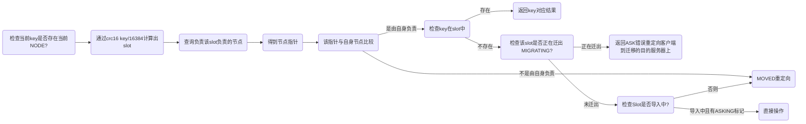

# Redis 高可用


[[toc]]


## Redis 读写分离

> 读写分离相关参数如下

| 参数名                     | 默认值 | 描述                                                         |
| -------------------------- | ------ | ------------------------------------------------------------ |
| `slave-read-only`          | `yes`  | 如果设置为 `yes`，则从服务器将只能进行只读操作               |
| `slave-priority`           | `100`  | 如果主服务器下线，从服务器会被提升为主服务器，`slave-priority` 用于决定哪个从服务器将被提升 |
| `repl-disable-tcp-nodelay` | `no`   | 如果设置为 `yes`，则从服务器将禁用 Nagle 算法（TCP_NODELAY），以提高性能 |
| `repl-diskless-sync`       | `no`   | 如果设置为 `yes`，则主服务器将使用 `bgsave` 命令创建一个 RDB 快照，并在同步到从服务器时，使用 `psync` 命令进行在线复制 |
| `repl-diskless-sync-delay` | `5`    | `repl-diskless-sync` 为 `yes` 时，从服务器使用 `psync` 命令复制数据的延迟时间（以秒为单位） |
| `repl-backlog-size`        | `1mb`  | 从服务器可以请求的主服务器复制缓冲区的大小。可以使用 K、M、G 等后缀指定大小 |
| `repl-backlog-ttl`         | `3600` | 主服务器将日志保存在复制缓冲区中的时间（以秒为单位），过期的日志将从缓冲区中删除 |
| `min-slaves-to-write`      | `0`    | 如果从服务器的数量少于 `min-slaves-to-write`，则主服务器将停止接受写操作 |
| `min-slaves-max-lag`       | `10`   | `min-slaves-to-write` 为非零值时，如果从服务器滞后于主服务器超过 `min-slaves-max-lag` 秒，则主服务器将停止接受写操作 |


## Redis 主从复制

:::info 说明

主库可以读写，会和从库进行数据同步

这种模式下，客户端直接连接主库或者从库，但是当主库或者从库宕机后，客户端需要手动修改 IP。但是这种模式比较难进行扩容，整个集群所能存储的数据受到某台机器的内存容量的限制，所以不能支持特大量的数据

:::


### 主从复制概述


- 将一台 redis 服务器的数据复制到其他 redis 服务器。前者称为主节点 master/leader，后者称为从节点 slave/follower
- 数据的复制时单向的，只有由主节点到从节点。master 以写为主，slave 以读为主
- 默认情况下，每台 redis 服务器都是主节点，一个主节点可以有多个从节点，但一个从节点只能有一个主节点
- 主从复制的作用主要包括：
  - 数据冗余：主从复制实现了数据的热备份，时持久化之外的一种数据冗余方式
  - 故障恢复：当主节点出现问题时，可以由从节点提供服务，实现快速的故障恢复，这是一种服务的冗余
  - 负载均衡：在主从复制的基础上，配合读写分离，可以由主节点提供写服务，由从节点提供读服务，分担服务器的压力
  - 高可用：主从复制还是哨兵和集群能够实施的基础，因此也是高可用的基础
- 主从复制实现读写分离一般都是使用一主二从
- 当 slave 成功连接到 master 后会发送一个 sync 同步命令，master 接收命令后会启动后台的存盘进程，同时收集所有接收到的用于修改数据集的命令，在后台程序执行完毕之后 master 将传送整个数据文件到 slave 并完成一次同步（只要是连接到主机就会进行一次全量复制）
  - 全量复制：slave 服务在接收到数据库文件后将其存盘并加载到内存中
  - 增量复制：master 继续将新的收集到的修改命令传给 slave 完成同步

| 序号 |       命令       |         说明         |
| :--: | :--------------: | :------------------: |
|  1   | info replication |     查看主从信息     |
|  2   | slaveof ip port  |      指定主节点      |
|  3   |  slaveof no one  | 让当前节点成为主节点 |

**注意：**

全量复制（2.8 之前只有全量复制）：

1. 主节点通过bgsave命令fork子进程进行RDB持久化，该过程是非常消耗CPU、内存(页表复制)、硬盘IO的
2. 主节点通过网络将RDB文件发送给从节点，对主从节点的带宽都会带来很大的消耗
3. 从节点清空老数据、载入新RDB文件的过程是阻塞的，无法响应客户端的命令；如果从节点执行 bgrewriteaof，也会带来额外的消耗

增量复制：

1. 复制偏移量：执行复制的双方，主从节点，分别会维护一个复制偏移量 offset
2. 复制积压缓冲区：主节点内部维护了一个固定长度的、先进先出(FIFO)队列 作为复制积压缓冲区，当主从节点offset的差距过大超过缓冲区长度时，将无法执行部分复制，只能执行全量复制
3. 服务器运行ID(runid)：每个Redis节点，都有其运行ID，运行ID由节点在启动时自动生成，主节点会将自己的运行ID发送给从节点，从节点会将主节点的运行ID存起来。 从节点Redis断开重连的时候，就是根据运行ID来判断同步的进度：
   1. 如果从节点保存的runid与主节点现在的runid相同，说明主从节点之前同步过，主节点会继续尝试使用部分复制(到底能不能部分复制还要看offset和复制积压缓冲区的情况)
   2. 如果从节点保存的runid与主节点现在的runid不同，说明从节点在断线前同步的Redis节点并不是当前的主节点，只能进行全量复制


### 主从复制环境搭建

1. 设置：`repl-disable-tcp-nodelay no`，如果是 yes，那么 TCP 连接发送的数据块会尽可能大，会降低网络延迟，但是会有延迟，所以这里要设置成 no
2. 设置密码时全部节点都必须相同，同时主节点必须设置 `masterauth`

创建不同配置文件搭建伪集群，目录为：`<path>/redis/cluster`，包含四个文件：

1. logs 目录
2. redis.conf
3. redis6380.conf
4. redis6381.conf
5. redis6382.conf

```shell
# 包含共同的配置
include redis.conf

# pid 文件
pidfile /var/run/redis_6381.pid

# 启动端口
port 6381

# 持久化文件名
dbfilename dump6381.rdb

# aof 文件名
appendfilename "appendonly6381.aof"

# 日志文件名
logfile "logs/redis6381.log"

# 优先级
replica-priority 90
```

```shell
# 启动
<path>/redis/redis-7.0.11/src/redis-server ./redis6380.conf
<path>/redis/redis-7.0.11/src/redis-server ./redis6381.conf
<path>/redis/redis-7.0.11/src/redis-server ./redis6382.conf
```

一主二从：

```shell
# redis6381、redis6382 设置主从关系
slaveof 127.0.0.1 6380

# 查看信息
info replication

# redis6380
role:master
connected_slaves:2
slave0:ip=127.0.0.1,port=6381,state=online,offset=266,lag=0
slave1:ip=127.0.0.1,port=6382,state=online,offset=266,lag=0
master_failover_state:no-failover
master_replid:ae84679f409d5a278446eb62312ad14b62f60d78
master_replid2:0000000000000000000000000000000000000000
master_repl_offset:266
second_repl_offset:-1
repl_backlog_active:1
repl_backlog_size:1048576
repl_backlog_first_byte_offset:1
repl_backlog_histlen:266

# redis6381
role:slave
master_host:127.0.0.1
master_port:6380
master_link_status:up
master_last_io_seconds_ago:1
master_sync_in_progress:0
slave_read_repl_offset:196
slave_repl_offset:196
slave_priority:90
slave_read_only:1
replica_announced:1
connected_slaves:0
master_failover_state:no-failover
master_replid:ae84679f409d5a278446eb62312ad14b62f60d78
master_replid2:0000000000000000000000000000000000000000
master_repl_offset:196
second_repl_offset:-1
repl_backlog_active:1
repl_backlog_size:1048576
repl_backlog_first_byte_offset:29
repl_backlog_histlen:168
```

一主一从（+一从），即三级关系，让 6382 成为 6381 的从节点，这样可以分摊主节点的压力：

```shell
# 6382 改变主从关系
slaveof 127.0.0.1 6381

# 6380
role:master
connected_slaves:1
slave0:ip=127.0.0.1,port=6381,state=online,offset=1566,lag=0
master_failover_state:no-failover
master_replid:ae84679f409d5a278446eb62312ad14b62f60d78
master_replid2:0000000000000000000000000000000000000000
master_repl_offset:1566
second_repl_offset:-1
repl_backlog_active:1
repl_backlog_size:1048576
repl_backlog_first_byte_offset:1
repl_backlog_histlen:1566

# 6381
role:slave
master_host:127.0.0.1
master_port:6380
master_link_status:up
master_last_io_seconds_ago:3
master_sync_in_progress:0
slave_read_repl_offset:1524
slave_repl_offset:1524
slave_priority:90
slave_read_only:1
replica_announced:1
connected_slaves:1
slave0:ip=127.0.0.1,port=6382,state=online,offset=1524,lag=1
master_failover_state:no-failover
master_replid:ae84679f409d5a278446eb62312ad14b62f60d78
master_replid2:0000000000000000000000000000000000000000
master_repl_offset:1524
second_repl_offset:-1
repl_backlog_active:1
repl_backlog_size:1048576
repl_backlog_first_byte_offset:15
repl_backlog_histlen:1510

# 不是任何一个节点的从节点，晋升为主节点
slaveof no one
```


### 主从复制同步过程


**sync 同步：**

1. Redis 2.8 之前，主从同步过程中进行的是全量复制，过程中可能会因为网络抖动导致复制过程中断，当网络恢复后又会从头开始全量复制。
2. 全量复制过程非常耗时，期间发生网络抖动的概率很大。

**psync 同步：**

Redis 2.8 之后，全量复制采用不完全同步策略（psync），当断开连接重连后可以进行「断点续传」，即从断开处继续复制，大大提高了性能。psync 中有三个关键点：

1. 复制偏移量（offset）：主从节点都会维护这个变量以支持断点续传
2. 主节点复制 ID：master 启动时动态生成的 ID，数据同步时供 slave 识别。不使用 ip + port 的形式标识，而是使用 ID（每次重启重新生成），这样可以预防主节点挂掉后数据丢失，但从节点不知道而继续复制
3. 复制积压缓冲区：当 master 连接 slave 时，master 会维护 backlog 队列，默认大小为 1 MB。主节点写入数据时会写入三处：本地内存、发送数据给 slave 的缓冲区、复制积压缓冲区。复制积压缓冲区的作用就是用于保存最近操作的数据，以备「断点续传」时进行「数据补充」，防止数据丢失

注意：psync 过程中可能出现 slave 节点「重启」或者「易主」，这样都会导致全量复制，Redis 4.0 之后解决了这两个问题（将 master ID 写到了持久化文件中）


### 主从复制数据同步优化

**无盘操作：**

Redis 6.0 对同步过程进行了改进，提出了「无盘全量同步」和「无盘加载」策略，避免耗时的 IO 操作：

1. 无盘全量同步：master 主进程 fork 子进程，直接将内存中的数据发送给 slave
2. 无盘加载：slave 接收到 master 发送过来的数据直接写入内存中完成数据恢复
3. **注意：**无盘操作时虽然是直接发送内存中的数据，但是发送过程中是网络操作耗时较长，数据会持续堆积到复制积压缓冲区，传输完成后再写入内存中，这样可能反而会**降低性能**（如果是写入磁盘再发送，那么数据积压就不会很多，因为一旦写入到磁盘中就可以写入内存，同时再将持久化数据发送出去），在高并发的写操作中使用无盘操作并不是好的选择

**共享复制积压缓冲区：**

Redis 7.0 对复制积压缓冲区进行了优化，让各个 slave 的发送缓冲区变为同一个共享复制积压缓冲区，注意由于共享数据并且需要发送数据，所以共享复制积压缓冲区是只读的，这也意味着还是需要一个缓冲区进行写操作。所以从整体上看，实际上是把各个 slave 发送缓冲区合并成了一个共享复制积压缓冲区


## Redis 哨兵模式

:::info 说明

Redis 2.6 之后引入的，核心功能是主节点自动故障转移

在主从模式的基础上新增了 **哨兵节点**，主库宕机后哨兵会发现这一情况，然后从从库中选择一个作为新的主库。此外哨兵本身也可以做集群，从而保证某一个哨兵挂掉后还有其他的可以工作。这种模式能够较好地保证 Redis 集群的高可用，但是==仍然不能很好解决 Redis 容量上限的问题==

:::


### 哨兵模式概述

**关注点：**

- 哨兵是 redis提供的一种特殊的模式，是一个独立的进程。原理是哨兵通过发送命令等待 redis 服务相应从而监控运行的多个 redis 实例是否可用
- 哨兵的作用：
  - 通过发送命令监控 redis 集群的状态
  - 当哨兵检测到 master 宕机时会将 slave 切换成 master，然后通过发布订阅模式通知其他的从服务器修改配置文件，以此让它们自动切换主节点
- 主从切换：当主服务器宕机后，使用哨兵模式会根据投票数自动将某一个从节点变成主节点。主库选举做法：
  - 过滤掉不健康的（下线或断线），没有回复过哨兵ping响应的从节点
  - 选择 `salve-priority` 从节点优先级最高（redis.conf）的
  - 选择复制偏移量最大，只复制最完整的从节点
- Leader 选举：通常哨兵也会搭建一个集群形成多哨兵模式保证高可用，哨兵的选举机制就是一个Raft选举算法： **选举的票数大于等于 num(sentinels) / 2 + 1 时，将成为领导者，如果没有超过，继续选举**，同时拿到的票数同时还需要大于等于哨兵配置文件中的 quorum 值
- 下线检测：在多哨兵模式下，要是其中一个哨兵检测到主节点宕机，并不会立即执行 failover（故障转移）过程，因为这仅仅是这个哨兵认为主节点不可用，这称为 **主观下线**。之后的哨兵也检测到主节点不可用并且达到一定数量时，哨兵之间会进行一次投票，投票结果由一个哨兵发起并进行 failover 操作。切换成功后就会通过发布订阅模式让各个哨兵切换主节点，这个过程称为 **客观下线**

**小结，哨兵的作用：**

- 监控：通过向主库发送命令（INFO）监控 redis 集群的状态
- 自动故障转移：当哨兵检测到 master 宕机时会将 slave 切换成 master，然后通过发布订阅模式通知其他的从服务器修改配置文件，以此让它们自动切换主节点
- 提供配置：客户端初始化时通过连接哨兵来获取当前 Redis 服务的主节点地址
- 通知：客户端可以把故障转移的结果发送给客户端


### 哨兵模式环境搭建

将 `sentinel.conf` 文件复制到先前创建的 `<path>/redis/cluster` 伪集群目录下，之后修改文件配置：

```shell
# 指定监控的 master，最后一个参数是 quorum，这里具体含义就是：如果有 2 个哨兵认为 master 下线了，那么就是客观下线
# 源文件中先注释掉下面这一行，之后 include 进来后再做特定配置
sentinel monitor mymaster 127.0.0.1 6379 2
```

新增三个文件：sentinel26380.conf、sentinel26381.conf、sentinel26382.conf，下面对应的数字做修改即可：

```shell
# 引入文件
include sentinel.conf

# 指定 pid 文件名
pidfile /var/run/sentinel_26380.pid

# 端口
port 26380

# 指定 master
sentinel monitor mymaster 127.0.0.1 6380 2

# 日志文件
logfile sentinel26380.log
```

启动哨兵集群：


```shell
# 可以使用下面的命令启动
<path>/redis/redis-7.0.11/src/redis-server sentinel26380.conf --sentinel
<path>/redis/redis-7.0.11/src/redis-server sentinel26381.conf --sentinel
<path>/redis/redis-7.0.11/src/redis-server sentinel26382.conf --sentinel

# 或者使用
<path>/redis/redis-7.0.11/src/redis-sentinel sentinel26380.conf
<path>/redis/redis-7.0.11/src/redis-sentinel sentinel26381.conf
<path>/redis/redis-7.0.11/src/redis-sentinel sentinel26382.conf

# 注意：哨兵也是一个特殊的 redis 数据库，也可以使用 redis-cli 或者其他客户端连接并查看信息，使用下面的命令查看哨兵信息
./redis-cli -p 26380 info sentinel

# 输出：
sentinel_masters:1
sentinel_tilt:0
sentinel_tilt_since_seconds:-1
sentinel_running_scripts:0
sentinel_scripts_queue_length:0
sentinel_simulate_failure_flags:0
master0:name=mymaster,status=ok,address=127.0.0.1:6380,slaves=2,sentinels=3
```

启动后 sentinel26380.conf 文件发生改变：

```shell
# 引入文件
include sentinel.conf

# 指定 pid 文件名
pidfile "/var/run/sentinel_26380.pid"

# 端口
port 26380

# 指定 master
sentinel monitor mymaster 127.0.0.1 6380 2

# 日志文件
logfile "sentinel26380.log"

# 下面的内容与选举有关
# Generated by CONFIG REWRITE
dir "/tmp"
latency-tracking-info-percentiles 50 99 99.9
protected-mode no
user default on nopass sanitize-payload ~* &* +@all
sentinel myid efa7599f998f209a5e2c96992ebebc193177a301
sentinel config-epoch mymaster 0
sentinel leader-epoch mymaster 0
sentinel current-epoch 0

sentinel known-replica mymaster 127.0.0.1 6382

sentinel known-replica mymaster 127.0.0.1 6381

sentinel known-sentinel mymaster 127.0.0.1 26382 da95b20712c4fe5c45ac54bfddf5ac36ce02961b

sentinel known-sentinel mymaster 127.0.0.1 26381 08a2b224ce22cdd5f90a55c39d622226fe9f10b1
```

让当前 master 下线：

```shell
# 在 redis-cli 中关闭 master
shutdown

# 查看 6381 和 6382 节点上的信息
info replication

# 发现 6382 成为了 master
role:master
connected_slaves:1
slave0:ip=127.0.0.1,port=6381,state=online,offset=219496,lag=1
master_failover_state:no-failover
master_replid:340d1f14e7f8f83cd46a8c42735c1e8006d6460a
master_replid2:ad9090ecd7d98f94db838d58d5c8535c2e631e72
master_repl_offset:219643
second_repl_offset:210906
repl_backlog_active:1
repl_backlog_size:1048576
repl_backlog_first_byte_offset:5515
repl_backlog_histlen:214129

# 6381
role:slave
master_host:127.0.0.1
master_port:6382
master_link_status:up
master_last_io_seconds_ago:1
master_sync_in_progress:0
slave_read_repl_offset:217354
slave_repl_offset:217354
slave_priority:90
slave_read_only:1
replica_announced:1
connected_slaves:0
master_failover_state:no-failover
master_replid:340d1f14e7f8f83cd46a8c42735c1e8006d6460a
master_replid2:ad9090ecd7d98f94db838d58d5c8535c2e631e72
master_repl_offset:217354
second_repl_offset:210906
repl_backlog_active:1
repl_backlog_size:1048576
repl_backlog_first_byte_offset:5515
repl_backlog_histlen:211840
```

查看 6381 和 6382 节点的配置文件，可以发现被动态修改了：

6381 配置文件如下：

```shell
# 包含共同的配置
include redis.conf
# pid 文件
pidfile "/var/run/redis_6381.pid"
# 启动端口
port 6381
# 持久化文件名
dbfilename "dump6381.rdb"
# aof 文件名
appendfilename "appendonly6381.aof"
# 日志文件名
logfile "logs/redis6381.log"
# 优先级
replica-priority 90

# Generated by CONFIG REWRITE
dir "/usr/local/redis/cluster"
bind 0.0.0.0
daemonize yes
protected-mode no
replicaof 127.0.0.1 6382
latency-tracking-info-percentiles 50 99 99.9
save 3600 1
save 300 100
save 60 10000
user default on nopass ~* &* +@all
```

6382 配置文件如下：

```shell
# 包含共同的配置
include redis.conf
# pid 文件
pidfile "/var/run/redis_6382.pid"
# 启动端口
port 6382
# 持久化文件名
dbfilename "dump6382.rdb"
# aof 文件名
appendfilename "appendonly6382.aof"
# 日志文件名
logfile "logs/redis6382.log"
# 优先级
replica-priority 90

# Generated by CONFIG REWRITE
dir "/usr/local/redis/cluster"
latency-tracking-info-percentiles 50 99 99.9
bind 0.0.0.0
protected-mode no
daemonize yes
save 3600 1
save 300 100
save 60 10000
user default on nopass ~* &* +@all
```

查看任意一个 sentinel 配置文件，发现也有动态修改的内容（mymaster 变成了 6382）：

26380 配置文件如下：

```shell
# 引入文件
include sentinel.conf
# 指定 pid 文件名
pidfile "/var/run/sentinel_26380.pid"
# 端口
port 26380
# 指定 master
sentinel monitor mymaster 127.0.0.1 6382 2
# 日志文件
logfile "sentinel26380.log"

# Generated by CONFIG REWRITE
dir "/tmp"
latency-tracking-info-percentiles 50 99 99.9
protected-mode no
user default on nopass sanitize-payload ~* &* +@all
sentinel myid efa7599f998f209a5e2c96992ebebc193177a301
sentinel config-epoch mymaster 1
sentinel leader-epoch mymaster 1
sentinel current-epoch 1

sentinel known-replica mymaster 127.0.0.1 6380

sentinel known-replica mymaster 127.0.0.1 6381

sentinel known-sentinel mymaster 127.0.0.1 26382 da95b20712c4fe5c45ac54bfddf5ac36ce02961b

sentinel known-sentinel mymaster 127.0.0.1 26381 08a2b224ce22cdd5f90a55c39d622226fe9f10b1
```

此时将 6380 重新启动，会发现：

```shell
# 6380 成为了 6382 的从节点
role:slave
master_host:127.0.0.1
master_port:6382
master_link_status:up
master_last_io_seconds_ago:0
master_sync_in_progress:0
slave_read_repl_offset:317778
slave_repl_offset:317778
slave_priority:100
slave_read_only:1
replica_announced:1
connected_slaves:0
master_failover_state:no-failover
master_replid:340d1f14e7f8f83cd46a8c42735c1e8006d6460a
master_replid2:0000000000000000000000000000000000000000
master_repl_offset:317778
second_repl_offset:-1
repl_backlog_active:1
repl_backlog_size:1048576
repl_backlog_first_byte_offset:316678
repl_backlog_histlen:1101
```


### 哨兵模式原理

**定时任务：**

Sentinel 维护着三个定时任务以监控 Redis 节点和其他 Sentinel 节点的状态

1. info 任务：每 10 秒就向 Redis 集群中的每个节点发送 info命令，以获取最新的 Redis 拓扑结构
2. 心跳任务：每个 Sentinel 节点每 1 秒向 Redis 节点以及 Sentinel 节点发送 ping 命令，用于检测这些节点的存活状态，这是判断在线的重要依据
3. 发布/订阅任务：Sentinel 每两秒会向 Redis 节点发送一条 `__sentinel__:hello` 主题信息，由于所有的 Redis 节点以及 Sentinel 都是订阅者，所以每一个节点包括自身都会收到信息，当 Sentinel 接收到信息后，会进行：
   1. 如果有新的 Sentinel 加入，那么就记录下 Sentinel 节点的信息并进行连接
   2. 如果发现有 Sentinel Leader 选举的选票，就执行 Leader 选举过程
   3. 汇总其他 Sentinel 节点对当前 Redis 节点在线情况的判断结果，作为 Redis 客观下线的判断依据

**Leader 选举：**

Leader 选举出来后会由该 Leader 进行「故障转移」，故障转移算法通过 Raft 算法实现

每个选举着都具有当选 Leader 的资格，当其完成了客观下线的判断之后，会自荐自己成为 Leader，然后将提案发送给每个 Sentinel 节点

其他参与者在收到提案后，如果自己还有选票就会立刻投出，后续其他再来的提案会因为没有选票而被拒绝

当提案者收到的同意数量大于等于 max(quorum, sentinelNum / 2 + 1) 时，该提案者会成为 Leader

**master 选举：**

> TODO


## Redis Cluster 分布式方案

:::info 说明

Redis Cluster是Redis提供的分布式集群解决方案，可以将数据分散在多个节点上，提高Redis的可用性和性能。

支持 **多主多从**，会按照 key 进行槽位分配，可以使得不同的 key 分散到不同的主节点上，是较为常用的一种模式。

利用这种模式可以使得整个集群支持更大的数据容量，同时主节点还可以用于多个从节点，如果主节点宕机，那么就会从从节点中选举一个作为新的主节点。

如果 Redis 需要存储的数据量不大，那么可以选择哨兵模式；如果存储的数据量大，并且需要持续扩容，那么选择 Cluster 模式。

:::

1. 架构：Redis Cluster的架构由多个节点组成，每个节点都有自己的ID和IP地址。在Redis Cluster中，数据被分片存储在多个节点上，每个节点可以存储一个或多个分片，同时每个分片都有自己的主节点和若干个从节点。
2. 配置：在Redis Cluster中，需要配置一些参数来保证集群的正常运行。其中最重要的参数包括哈希槽数量、节点数、节点IP地址和端口号等。
3. 分片算法：Redis Cluster使用一种称为哈希槽的分片算法来将数据分配到不同的节点上。哈希槽的数量在创建集群时指定，每个哈希槽都有一个编号，可以将其看作是一个虚拟的分片，Redis Cluster将数据的键通过哈希函数计算得到一个哈希值，然后根据哈希值将数据分配到对应的哈希槽上。
4. 在Redis Cluster中，每个节点有以下三种状态：
   - 主节点：负责处理对应哈希槽上的读写请求，并且可以将该哈希槽的数据同步给从节点。
   - 从节点：负责复制主节点上的数据，并且可以接收客户端的只读请求。
   - 未知节点：节点状态未知或者无法连接。
5. 数据同步：Redis Cluster使用异步复制来同步主节点和从节点的数据。当主节点上的数据发生变化时，主节点将变化的数据异步地发送给从节点，从节点通过复制流程获取主节点上的变化数据。如果从节点和主节点之间的网络连接中断或者主节点宕机，从节点会自动尝试从其他主节点或者从节点中选举新的主节点来同步数据。
6. 故障转移：当主节点宕机或者出现网络分区时，Redis Cluster会自动进行故障转移，选举出一个新的主节点来负责原来主节点上的哈希槽。在进行故障转移时，Redis Cluster会将原来主节点上的数据同步到新的主节点上，保证数据的可用性和一致性。
7. 数据迁移：在Redis Cluster中，如果需要添加或者删除节点，需要进行数据迁移操作。当添加新节点时，需要将原来节点上的一部分数据迁移至新节点上。当删除节点时，需要将该节点上的数据迁移至其他节点上。Redis Cluster使用增量复制和重定向来进行数据迁移，保证数据的完整性和一致性。


### 环境搭建

创建 `cluster-dis` 目录，将主从复制中的 `redis.conf` 和 `redis6380.conf` 文件拷贝到该目录下，用于伪集群的搭建，最终该目录下的文件包括：

1. logs 目录
2. redis.conf
3. redis6390.conf、redis6391.conf、redis6392.conf、redis6393.conf、redis6394.conf、redis6395.conf
4. start-cluster.sh、shutdown-cluster.sh

```shell
# 修改 redis.conf 目录的配置
# 设置工作目录
dir "/usr/local/redis/cluster-dis"

# 设置集群模式
cluster-enabled yes

# 节点超时设置
cluster-node-timeout 15000

# 修改 redis6380.conf 文件为 redis6390.conf，并添加配置 cluster-config-file nodes-6390.conf，完整配置如下：
# 包含共同的配置
include redis.conf
# pid 文件
pidfile "/var/run/redis_6390.pid"
# 启动端口
port 6390
# 持久化文件名
dbfilename "dump6390.rdb"
# aof 文件名
appendfilename "appendonly6390.aof"
# 日志文件名
logfile "logs/redis6390.log"
# 优先级
replica-priority 100
# 集群节点配置文件，只能由 redis 修改，不能手动修改
cluster-config-file nodes-6390.conf
```

完成上面的配置后，再根据 `redis6390.conf` 复制多 5 个配置文件，也即最终要启动 6 个节点

配置文件完成后，创建启动脚本 `start-cluster.sh`

```shell
#!/bin/bash

rm -rf dump639*.rdb

rm -rf appendonlydir

rm -rf nodes-639*.conf

# 这里可以改成循环，redis-server 也可以加到环境变量中
../redis-7.0.11/src/redis-server redis6390.conf
../redis-7.0.11/src/redis-server redis6391.conf
../redis-7.0.11/src/redis-server redis6392.conf
../redis-7.0.11/src/redis-server redis6393.conf
../redis-7.0.11/src/redis-server redis6394.conf
../redis-7.0.11/src/redis-server redis6395.conf

../redis-7.0.11/src/redis-cli --cluster create --cluster-replicas 1 192.168.30.201:6390 192.168.30.201:6391 192.168.30.201:6392 192.168.30.201:6393 192.168.30.201:6394 192.168.30.201:6395
```

创建关闭脚本 `shutdown-cluster.sh`

```shell
#!/bin/bash

# 这里可以改成循环，redis-cli 也可以加到环境变量中
../redis-7.0.11/src/redis-cli -p 6390 shutdown
../redis-7.0.11/src/redis-cli -p 6391 shutdown
../redis-7.0.11/src/redis-cli -p 6392 shutdown
../redis-7.0.11/src/redis-cli -p 6393 shutdown
../redis-7.0.11/src/redis-cli -p 6394 shutdown
../redis-7.0.11/src/redis-cli -p 6395 shutdown

ps -aux | grep redis
```

```shell
# 记得给脚本赋予执行权限
chmod 755 start-cluster.sh
chmod 755 shutdown-cluster.sh

# 启动集群
./start-cluster.sh

# 成功启动
>>> Performing hash slots allocation on 6 nodes...
Master[0] -> Slots 0 - 5460
Master[1] -> Slots 5461 - 10922
Master[2] -> Slots 10923 - 16383
Adding replica 192.168.30.201:6394 to 192.168.30.201:6390
Adding replica 192.168.30.201:6395 to 192.168.30.201:6391
Adding replica 192.168.30.201:6393 to 192.168.30.201:6392
>>> Trying to optimize slaves allocation for anti-affinity
[WARNING] Some slaves are in the same host as their master
M: ce256073cdeac46161646fd30d780b82d554bfe3 192.168.30.201:6390
   slots:[0-5460] (5461 slots) master
M: 3a1c540f396a3a8cab51b036441715da0e8a2fd8 192.168.30.201:6391
   slots:[5461-10922] (5462 slots) master
M: cc668b504326bdf302030da99fe45b9759ab753c 192.168.30.201:6392
   slots:[10923-16383] (5461 slots) master
S: 96a06843686d9a72fa7fe78d1c4ce34c89158ef7 192.168.30.201:6393
   replicates ce256073cdeac46161646fd30d780b82d554bfe3
S: 76e9e51c42c951b3290dd61daf60a77b69ac8b03 192.168.30.201:6394
   replicates 3a1c540f396a3a8cab51b036441715da0e8a2fd8
S: e0a8858d0c07d42c4d71a33bacf495b9682c6842 192.168.30.201:6395
   replicates cc668b504326bdf302030da99fe45b9759ab753c
Can I set the above configuration? (type 'yes' to accept): yes
>>> Nodes configuration updated
>>> Assign a different config epoch to each node
>>> Sending CLUSTER MEET messages to join the cluster
Waiting for the cluster to join

>>> Performing Cluster Check (using node 192.168.30.201:6390)
M: ce256073cdeac46161646fd30d780b82d554bfe3 192.168.30.201:6390
   slots:[0-5460] (5461 slots) master
   1 additional replica(s)
M: cc668b504326bdf302030da99fe45b9759ab753c 192.168.30.201:6392
   slots:[10923-16383] (5461 slots) master
   1 additional replica(s)
S: e0a8858d0c07d42c4d71a33bacf495b9682c6842 192.168.30.201:6395
   slots: (0 slots) slave
   replicates cc668b504326bdf302030da99fe45b9759ab753c
M: 3a1c540f396a3a8cab51b036441715da0e8a2fd8 192.168.30.201:6391
   slots:[5461-10922] (5462 slots) master
   1 additional replica(s)
S: 96a06843686d9a72fa7fe78d1c4ce34c89158ef7 192.168.30.201:6393
   slots: (0 slots) slave
   replicates ce256073cdeac46161646fd30d780b82d554bfe3
S: 76e9e51c42c951b3290dd61daf60a77b69ac8b03 192.168.30.201:6394
   slots: (0 slots) slave
   replicates 3a1c540f396a3a8cab51b036441715da0e8a2fd8
[OK] All nodes agree about slots configuration.
>>> Check for open slots...
>>> Check slots coverage...
[OK] All 16384 slots covered.
```


```shell
# 查看节点信息
../redis-7.0.11/src/redis-cli -c -p 6390 cluster nodes

# 输出如下
ce256073cdeac46161646fd30d780b82d554bfe3 192.168.30.201:6390@16390 myself,master - 0 1683371217000 1 connected 0-5460
cc668b504326bdf302030da99fe45b9759ab753c 192.168.30.201:6392@16392 master - 0 1683371220643 3 connected 10923-16383
e0a8858d0c07d42c4d71a33bacf495b9682c6842 192.168.30.201:6395@16395 slave cc668b504326bdf302030da99fe45b9759ab753c 0 1683371220000 3 connected
3a1c540f396a3a8cab51b036441715da0e8a2fd8 192.168.30.201:6391@16391 master - 0 1683371220000 2 connected 5461-10922
96a06843686d9a72fa7fe78d1c4ce34c89158ef7 192.168.30.201:6393@16393 slave ce256073cdeac46161646fd30d780b82d554bfe3 0 1683371220000 1 connected
76e9e51c42c951b3290dd61daf60a77b69ac8b03 192.168.30.201:6394@16394 slave 3a1c540f396a3a8cab51b036441715da0e8a2fd8 0 1683371221651 2 connected

# 添加新节点
../redis-7.0.11/src/redis-cli -c --cluster add-node <ip>:<port> <ip>:<port> ...

# 添加完成后需要重新分配哈希槽
../redis-7.0.11/src/redis-cli -c --cluster reshard <ip>:<任意port>

# 添加新 slave
../redis-7.0.11/src/redis-cli -c --cluster add-node <ip>:<slaveport> <ip>:<clusterport> --cluster-master-id <targetmasterid>

# 移除 slave 节点缩容
../redis-7.0.11/src/redis-cli --cluster del-node <ip>:<port> <targetid>

# 移除 master 节点时需要重新分配哈希槽，否则集群不对外提供服务
../redis-7.0.11/src/redis-cli -c --cluster reshard <ip>:<任意port>
../redis-7.0.11/src/redis-cli --cluster del-node <ip>:<port> <targetid>
```


### 主要模块

1. 哈希槽：没有使用一致性 hash 而是新引入哈希槽，Cluster 中的每个节点负责一部分槽（槽位默认有 $2^{14}=16384$ 个）

2. Keys hash tags：**用来将多个(相关的)key分配到相同的hash slot中**。这是 Redis Cluster 中实现 multi-key 操作的基础。
3. Cluster Nodes 属性：每个节点都有唯一的名字，可以修改维护的 IP 而不改变名字，即节点维护着：
   1. 节点 ID
   2. 节点 IP
   3. 节点标签
   4. 主节点 ID
   5. 最后发送 ping 和接收 pong 的时间
   6. 链接状态
   7. 哈希槽
4. Cluster 总线：Redis Cluster的总线是一种用于节点之间通信的内部协议。Redis Cluster使用总线来实现节点之间的消息传递和状态同步。
5. Cluster 集群拓扑：可以为 **主从复制结构** 和 **节点互联结构**
6. 节点握手：确定节点是当前集群的一部分


### 请求重定向

> Redis cluster采用去中心化的架构，集群的主节点各自负责一部分槽，客户端如何确定key到底会映射到哪个节点上呢？这就是我们要讲的请求重定向。

在cluster模式下，**节点对请求的处理过程**如下：



上述过程的重点在于 **MOVED重定向** 和 **ASK重定向**。此外还可以使用 smart 客户端简化上述操作。


### 状态检测与通信状态

状态维护：底层协议使用 Gossip，通讯机制是心跳检测机制，Cluster中的每个节点都维护一份在自己看来当前整个集群的状态，主要包括：

1. 当前集群状态
2. 集群中各节点所负责的slots信息，及其migrate状态
3. 集群中各节点的master-slave状态
4. 集群中各节点的存活状态及不可达投票

心跳机制关心的问题：

1. 什么时候进行心跳？
2. 发送哪些心跳数据？
3. 如何处理心跳？
4. 如何广播给其他节点？


### 故障恢复

当slave发现自己的master变为FAIL状态时，便尝试进行Failover，以期成为新的master。由于挂掉的master可能会有多个slave。Failover的过程需要经过类Raft协议的过程在整个集群内达到一致， 其过程如下：

- slave发现自己的master变为FAIL
- 将自己记录的集群currentEpoch加1，并广播Failover Request信息
- 其他节点收到该信息，只有master响应，判断请求者的合法性，并发送FAILOVER_AUTH_ACK，对每一个epoch只发送一次ack
- 尝试failover的slave收集FAILOVER_AUTH_ACK
- 超过半数后变成新Master
- 广播Pong通知其他集群节点

当原本的 master 重新启动后会自动变为当前 master 的 slave


### 扩容与缩容

**扩容：**

当集群出现容量限制或者其他一些原因需要扩容时，redis cluster提供了比较优雅的集群扩容方案。

1. 首先将新节点加入到集群中，可以通过在集群中任何一个客户端执行cluster meet 新节点ip:端口，或者通过redis-trib add node添加，新添加的节点默认在集群中都是主节点。
2. 迁移数据 迁移数据的大致流程是，首先需要确定哪些槽需要被迁移到目标节点，然后获取槽中key，将槽中的key全部迁移到目标节点，然后向集群所有主节点广播槽（数据）全部迁移到了目标节点。直接通过redis-trib工具做数据迁移很方便。 现在假设将节点A的槽10迁移到B节点，过程如下：

```bash
B:cluster setslot 10 importing A.nodeId
A:cluster setslot 10 migrating B.nodeId
```

循环获取槽中key，将key迁移到B节点

```bash
A:cluster getkeysinslot 10 100
A:migrate B.ip B.port "" 0 5000 keys key1[ key2....]
```

向集群广播槽已经迁移到B节点

```bash
cluster setslot 10 node B.nodeId
```

**缩容：**

缩容的大致过程与扩容一致，需要判断下线的节点是否是主节点，以及主节点上是否有槽，若主节点上有槽，需要将槽迁移到集群中其他主节点，槽迁移完成之后，需要向其他节点广播该节点准备下线（cluster forget nodeId）。最后需要将该下线主节点的从节点指向其他主节点，当然最好是先将从节点下线。


### 常见高可用方案

1. Redis Sentinel 集群 + Keepalived/Haproxy
2. Twemproxy
3. Codis


### Claster 的限制

1. 仅支持 0 号数据库
2. 不支持批量 key 操作
3. 分区仅限于 key
4. 对事务支持有限制
5. 不支持分级管理