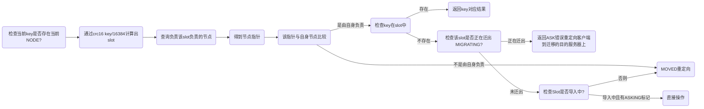

# Redis 高可用


## 1.Redis 主从复制

:::info 说明

主库可以读写，会和从库进行数据同步

这种模式下，客户端直接连接主库或者从库，但是当主库或者从库宕机后，客户端需要手动修改 IP。但是这种模式比较难进行扩容，整个集群所能存储的数据受到某台机器的内存容量的限制，所以不能支持特大量的数据

:::

- 将一台 redis 服务器的数据复制到其他 redis 服务器。前者称为主节点 master/leader，后者称为从节点 slave/follower
- 数据的复制时单向的，只有由主节点到从节点。master 以写为主，slave 以读为主
- 默认情况下，每台 redis 服务器都是主节点，一个主节点可以有多个从节点，但一个从节点只能有一个主节点
- 主从复制的作用主要包括：
  - 数据冗余：主从复制实现了数据的热备份，时持久化之外的一种数据冗余方式
  - 故障恢复：当主节点出现问题时，可以由从节点提供服务，实现快速的故障恢复，这是一种服务的冗余
  - 负载均衡：在主从复制的基础上，配合读写分离，可以由主节点提供写服务，由从节点提供读服务，分担服务器的压力
  - 高可用：主从复制还是哨兵和集群能够实施的基础，因此也是高可用的基础
- 主从复制实现读写分离一般都是使用一主二从
- 当 slave 成功连接到 master 后会发送一个 sync 同步命令，master 接收命令后会启动后台的存盘进程，同时收集所有接收到的用于修改数据集的命令，在后台程序执行完毕之后 master 将传送整个数据文件到 slave 并完成一次同步（只要是连接到主机就会进行一次全量复制）
  - 全量复制：slave 服务在接收到数据库文件后将其存盘并加载到内存中
  - 增量复制：master 继续将新的收集到的修改命令传给 slave 完成同步

| 序号 |       命令       |         说明         |
| :--: | :--------------: | :------------------: |
|  1   | info replication |     查看主从信息     |
|  2   | slaveof ip port  |      指定主节点      |
|  3   |  slaveof no one  | 让当前节点成为主节点 |

**注意：**

全量复制（2.8 之前只有全量复制）：

1. 主节点通过bgsave命令fork子进程进行RDB持久化，该过程是非常消耗CPU、内存(页表复制)、硬盘IO的
2. 主节点通过网络将RDB文件发送给从节点，对主从节点的带宽都会带来很大的消耗
3. 从节点清空老数据、载入新RDB文件的过程是阻塞的，无法响应客户端的命令；如果从节点执行 bgrewriteaof，也会带来额外的消耗

增量复制：

1. 复制偏移量：执行复制的双方，主从节点，分别会维护一个复制偏移量 offset
2. 复制积压缓冲区：主节点内部维护了一个固定长度的、先进先出(FIFO)队列 作为复制积压缓冲区，当主从节点offset的差距过大超过缓冲区长度时，将无法执行部分复制，只能执行全量复制
3. 服务器运行ID(runid)：每个Redis节点，都有其运行ID，运行ID由节点在启动时自动生成，主节点会将自己的运行ID发送给从节点，从节点会将主节点的运行ID存起来。 从节点Redis断开重连的时候，就是根据运行ID来判断同步的进度：
   1. 如果从节点保存的runid与主节点现在的runid相同，说明主从节点之前同步过，主节点会继续尝试使用部分复制(到底能不能部分复制还要看offset和复制积压缓冲区的情况)
   2. 如果从节点保存的runid与主节点现在的runid不同，说明从节点在断线前同步的Redis节点并不是当前的主节点，只能进行全量复制


## 2.Redis 哨兵模式

:::info 说明

Redis 2.8 之后引入的，核心功能是主节点自动故障转移

在主从模式的基础上新增了 **哨兵节点**，主库宕机后哨兵会发现这一情况，然后从从库中选择一个作为新的主库。此外哨兵本身也可以做集群，从而保证某一个哨兵挂掉后还有其他的可以工作。这种模式能够较好地保证 Redis 集群的高可用，但是==仍然不能很好解决 Redis 容量上限的问题==

:::

**关注点：**

- 哨兵是 redis提供的一种特殊的模式，是一个独立的进程。原理是哨兵通过发送命令等待 redis 服务相应从而监控运行的多个 redis 实例是否可用
- 哨兵的作用：
  - 通过发送命令监控 redis 集群的状态
  - 当哨兵检测到 master 宕机时会将 slave 切换成 master，然后通过发布订阅模式通知其他的从服务器修改配置文件，以此让它们自动切换主节点
- 主从切换：当主服务器宕机后，使用哨兵模式会根据投票数自动将某一个从节点变成主节点。主库选举做法：
  - 过滤掉不健康的（下线或断线），没有回复过哨兵ping响应的从节点
  - 选择`salve-priority`从节点优先级最高（redis.conf）的
  - 选择复制偏移量最大，只复制最完整的从节点
- Leader 选举：通常哨兵也会搭建一个集群形成多哨兵模式保证高可用，哨兵的选举机制就是一个Raft选举算法： **选举的票数大于等于 num(sentinels) / 2 + 1 时，将成为领导者，如果没有超过，继续选举**，同时拿到的票数同时还需要大于等于哨兵配置文件中的 quorum 值
- 下线检测：在多哨兵模式下，要是其中一个哨兵检测到主节点宕机，并不会立即执行 failover（故障转移）过程，因为这仅仅是这个哨兵认为主节点不可用，这称为 **主观下线**。之后的哨兵也检测到主节点不可用并且达到一定数量时，哨兵之间会进行一次投票，投票结果由一个哨兵发起并进行 failover 操作。切换成功后就会通过发布订阅模式让各个哨兵切换主节点，这个过程称为 **客观下线**

**小结，哨兵的作用：**

- 监控：通过向主库发送命令（INFO）监控 redis 集群的状态
- 自动故障转移：当哨兵检测到 master 宕机时会将 slave 切换成 master，然后通过发布订阅模式通知其他的从服务器修改配置文件，以此让它们自动切换主节点
- 提供配置：客户端初始化时通过连接哨兵来获取当前 Redis 服务的主节点地址
- 通知：客户端可以把故障转移的结果发送给客户端


## 3.Redis 读写分离

> 读写分离相关参数如下

| 参数名                     | 默认值 | 描述                                                         |
| -------------------------- | ------ | ------------------------------------------------------------ |
| `slave-read-only`          | `yes`  | 如果设置为 `yes`，则从服务器将只能进行只读操作               |
| `slave-priority`           | `100`  | 如果主服务器下线，从服务器会被提升为主服务器，`slave-priority` 用于决定哪个从服务器将被提升 |
| `repl-disable-tcp-nodelay` | `no`   | 如果设置为 `yes`，则从服务器将禁用 Nagle 算法（TCP_NODELAY），以提高性能 |
| `repl-diskless-sync`       | `no`   | 如果设置为 `yes`，则主服务器将使用 `bgsave` 命令创建一个 RDB 快照，并在同步到从服务器时，使用 `psync` 命令进行在线复制 |
| `repl-diskless-sync-delay` | `5`    | `repl-diskless-sync` 为 `yes` 时，从服务器使用 `psync` 命令复制数据的延迟时间（以秒为单位） |
| `repl-backlog-size`        | `1mb`  | 从服务器可以请求的主服务器复制缓冲区的大小。可以使用 K、M、G 等后缀指定大小 |
| `repl-backlog-ttl`         | `3600` | 主服务器将日志保存在复制缓冲区中的时间（以秒为单位），过期的日志将从缓冲区中删除 |
| `min-slaves-to-write`      | `0`    | 如果从服务器的数量少于 `min-slaves-to-write`，则主服务器将停止接受写操作 |
| `min-slaves-max-lag`       | `10`   | `min-slaves-to-write` 为非零值时，如果从服务器滞后于主服务器超过 `min-slaves-max-lag` 秒，则主服务器将停止接受写操作 |


## 4.Redis Cluster 分布式方案

:::info 说明

Redis Cluster是Redis提供的分布式集群解决方案，可以将数据分散在多个节点上，提高Redis的可用性和性能。

支持 **多主多从**，会按照 key 进行槽位分配，可以使得不同的 key 分散到不同的主节点上，是较为常用的一种模式。

利用这种模式可以使得整个集群支持更大的数据容量，同时主节点还可以用于多个从节点，如果主节点宕机，那么就会从从节点中选举一个作为新的主节点。

如果 Redis 需要存储的数据量不大，那么可以选择哨兵模式；如果存储的数据量大，并且需要持续扩容，那么选择 Cluster 模式。

:::

1. 架构：Redis Cluster的架构由多个节点组成，每个节点都有自己的ID和IP地址。在Redis Cluster中，数据被分片存储在多个节点上，每个节点可以存储一个或多个分片，同时每个分片都有自己的主节点和若干个从节点。
2. 配置：在Redis Cluster中，需要配置一些参数来保证集群的正常运行。其中最重要的参数包括哈希槽数量、节点数、节点IP地址和端口号等。
3. 分片算法：Redis Cluster使用一种称为哈希槽的分片算法来将数据分配到不同的节点上。哈希槽的数量在创建集群时指定，每个哈希槽都有一个编号，可以将其看作是一个虚拟的分片，Redis Cluster将数据的键通过哈希函数计算得到一个哈希值，然后根据哈希值将数据分配到对应的哈希槽上。
4. 在Redis Cluster中，每个节点有以下三种状态：
   - 主节点：负责处理对应哈希槽上的读写请求，并且可以将该哈希槽的数据同步给从节点。
   - 从节点：负责复制主节点上的数据，并且可以接收客户端的只读请求。
   - 未知节点：节点状态未知或者无法连接。
5. 数据同步：Redis Cluster使用异步复制来同步主节点和从节点的数据。当主节点上的数据发生变化时，主节点将变化的数据异步地发送给从节点，从节点通过复制流程获取主节点上的变化数据。如果从节点和主节点之间的网络连接中断或者主节点宕机，从节点会自动尝试从其他主节点或者从节点中选举新的主节点来同步数据。
6. 故障转移：当主节点宕机或者出现网络分区时，Redis Cluster会自动进行故障转移，选举出一个新的主节点来负责原来主节点上的哈希槽。在进行故障转移时，Redis Cluster会将原来主节点上的数据同步到新的主节点上，保证数据的可用性和一致性。
7. 数据迁移：在Redis Cluster中，如果需要添加或者删除节点，需要进行数据迁移操作。当添加新节点时，需要将原来节点上的一部分数据迁移至新节点上。当删除节点时，需要将该节点上的数据迁移至其他节点上。Redis Cluster使用增量复制和重定向来进行数据迁移，保证数据的完整性和一致性。


### 4.1 主要模块

1. 哈希槽：没有使用一致性 hash 而是新引入哈希槽，Cluster 中的每个节点负责一部分槽（槽位默认有 $2^{14}=16384$ 个）

2. Keys hash tags：**用来将多个(相关的)key分配到相同的hash slot中**。这是 Redis Cluster 中实现 multi-key 操作的基础。
3. Cluster Nodes 属性：每个节点都有唯一的名字，可以修改维护的 IP 而不改变名字，即节点维护着：
   1. 节点 ID
   2. 节点 IP
   3. 节点标签
   4. 主节点 ID
   5. 最后发送 ping 和接收 pong 的时间
   6. 链接状态
   7. 哈希槽
4. Cluster 总线：Redis Cluster的总线是一种用于节点之间通信的内部协议。Redis Cluster使用总线来实现节点之间的消息传递和状态同步。
5. Cluster 集群拓扑：可以为 **主从复制结构** 和 **节点互联结构**
6. 节点握手：确定节点是当前集群的一部分


### 4.2 请求重定向

> Redis cluster采用去中心化的架构，集群的主节点各自负责一部分槽，客户端如何确定key到底会映射到哪个节点上呢？这就是我们要讲的请求重定向。

在cluster模式下，**节点对请求的处理过程**如下：



上述过程的重点在于 **MOVED重定向** 和 **ASK重定向**。此外还可以使用 smart 客户端简化上述操作。


### 4.3 状态检测与通信状态

状态维护：底层协议使用 Gossip，通讯机制是心跳检测机制，Cluster中的每个节点都维护一份在自己看来当前整个集群的状态，主要包括：

1. 当前集群状态
2. 集群中各节点所负责的slots信息，及其migrate状态
3. 集群中各节点的master-slave状态
4. 集群中各节点的存活状态及不可达投票

心跳机制关心的问题：

1. 什么时候进行心跳？
2. 发送哪些心跳数据？
3. 如何处理心跳？
4. 如何广播给其他节点？


### 4.4 故障恢复

当slave发现自己的master变为FAIL状态时，便尝试进行Failover，以期成为新的master。由于挂掉的master可能会有多个slave。Failover的过程需要经过类Raft协议的过程在整个集群内达到一致， 其过程如下：

- slave发现自己的master变为FAIL
- 将自己记录的集群currentEpoch加1，并广播Failover Request信息
- 其他节点收到该信息，只有master响应，判断请求者的合法性，并发送FAILOVER_AUTH_ACK，对每一个epoch只发送一次ack
- 尝试failover的slave收集FAILOVER_AUTH_ACK
- 超过半数后变成新Master
- 广播Pong通知其他集群节点


### 4.5 扩容与缩容

**扩容：**

当集群出现容量限制或者其他一些原因需要扩容时，redis cluster提供了比较优雅的集群扩容方案。

1. 首先将新节点加入到集群中，可以通过在集群中任何一个客户端执行cluster meet 新节点ip:端口，或者通过redis-trib add node添加，新添加的节点默认在集群中都是主节点。
2. 迁移数据 迁移数据的大致流程是，首先需要确定哪些槽需要被迁移到目标节点，然后获取槽中key，将槽中的key全部迁移到目标节点，然后向集群所有主节点广播槽（数据）全部迁移到了目标节点。直接通过redis-trib工具做数据迁移很方便。 现在假设将节点A的槽10迁移到B节点，过程如下：

```bash
B:cluster setslot 10 importing A.nodeId
A:cluster setslot 10 migrating B.nodeId
```

循环获取槽中key，将key迁移到B节点

```bash
A:cluster getkeysinslot 10 100
A:migrate B.ip B.port "" 0 5000 keys key1[ key2....]
```

向集群广播槽已经迁移到B节点

```bash
cluster setslot 10 node B.nodeId
```

**缩容：**

缩容的大致过程与扩容一致，需要判断下线的节点是否是主节点，以及主节点上是否有槽，若主节点上有槽，需要将槽迁移到集群中其他主节点，槽迁移完成之后，需要向其他节点广播该节点准备下线（cluster forget nodeId）。最后需要将该下线主节点的从节点指向其他主节点，当然最好是先将从节点下线。


### 4.6 常见高可用方案

1. Redis Sentinel 集群 + Keepalived/Haproxy
2. Twemproxy
3. Codis