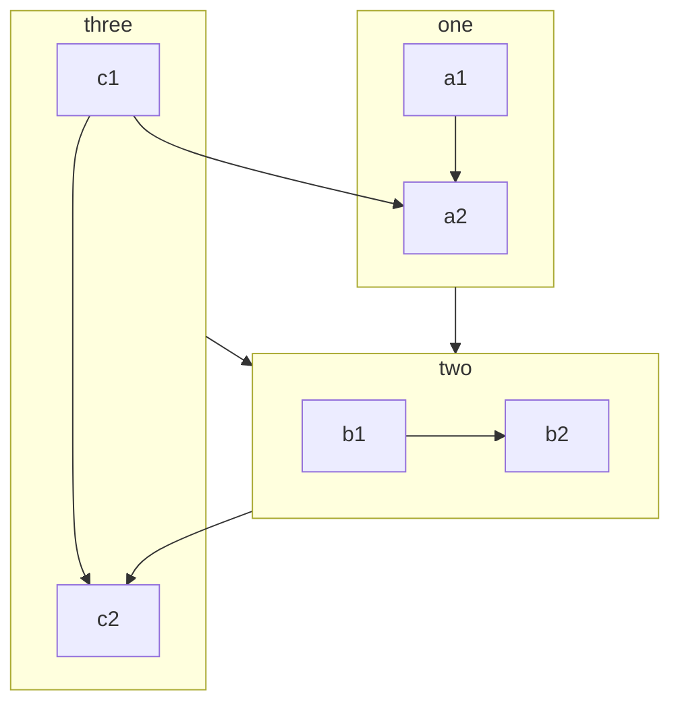
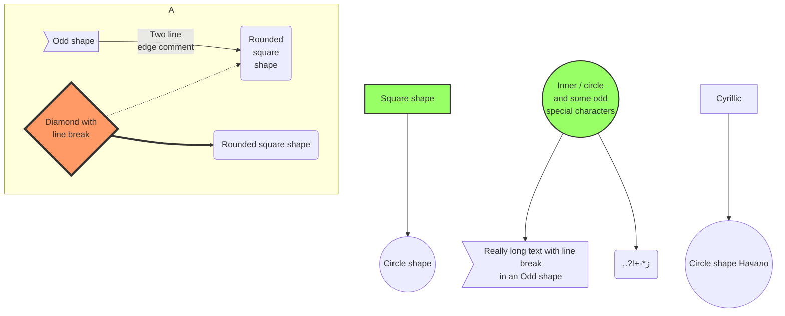

# 内容效果展示

[[toc]]


# 标题1 
## 标题2 
### 标题3 


## 上下角标
H~2~O  
19^th^


## 脚注
这是一段内容[^first]，点击可以到达内容的脚注  


## 段落
这是一个普通段落


## 引用
> 这是一个引用


## 任务列表
- [ ] 计划 A
- [x] 计划 B


## md 中直接使用 vue 组件

<!-- @include(../web/dogs.md) -->

<OtherComponent />

<!-- 这是默认主题内置的 `<Badge />` 组件 <Badge text="演示" />
<div>
  # test
  # test
  # test
  <button @click="change">{{ buttonName }}</button>
</div>

<script>
export default {
  name: "OtherComponent",
  data() {
    return {
      buttonName: "点击按钮"
    };
  },
  methods: {
    change() {
      console.log(111);
    }
  }
};
</script> -->


## 图片


## 代码块
```java
public
```

## 卡片


::: tabs#fruit


@tab 标题 1

<!-- tab 1 内容 -->


@tab 标题 2

<!-- tab 2 内容 -->

@tab:active 标题 3

<!-- tab 3 将会被默认激活 -->

<!-- tab 3 内容 -->

:::


## 代码块分组
安装 VuePress Theme Hope:

::: code-tabs#shell

@tab pnpm

```bash
pnpm add -D vuepress-theme-hope
```

@tab yarn

```bash
yarn add -D vuepress-theme-hope
```

@tab:active npm

```bash
npm i -D vuepress-theme-hope
```

:::

安装 VuePress Plugin Markdown Enhance:

::: code-tabs#shell

@tab pnpm

```bash
pnpm add -D vuepress-plugin-md-enhance
```

@tab yarn

```bash
yarn add -D vuepress-plugin-md-enhance
```

@tab:active npm

```bash
npm i -D vuepress-plugin-md-enhance
```

:::


## 属性支持
包含 `行内代码`{.inline-code} 和 {.image} 的文字，也支持 _强调_{.emphasis} 和 **加粗**{.bold}。

| 表格 |
| ---- |
| 内容 |

{.table}

- list item{.list-item}

  - nested list item
    {.nested}

{.list}

一行换行的文字  
{.break}

--- {.horizontal}

块级元素 {.block}


## 标记
示范： ==这是一个标记== 


## 自定义容器
::: para 段落 1
  这是一个自定义容器
:::

::: info
信息容器。
:::

::: note
注释容器。
:::

::: tip
提示容器
:::

::: warning 警告
警告容器
:::

::: danger
危险容器
:::

::: details
详情容器
:::

::: info 自定义标题

一个有 `代码` 和 [链接](#演示) 的信息容器。

```js
const a = 1;
```

:::

::: note 自定义标题

一个有 `代码` 和 [链接](#演示) 的注释容器。

```js
const a = 1;
```

:::

::: tip 自定义标题

一个有 `代码` 和 [链接](#演示) 的提示容器。

```js
const a = 1;
```

:::

::: warning 自定义标题

一个有 `代码` 和 [链接](#演示) 的警告容器。

```js
const a = 1;
```

:::

::: danger 自定义标题

一个有 `代码` 和 [链接](#演示) 的危险容器。

```js
const a = 1;
```

:::

::: details 自定义标题

一个有 `代码` 和 [链接](#演示) 的详情容器。

```js
const a = 1;
```

:::

::: info 自定义信息
:::

::: note 自定义注释
:::

::: tip 自定义提示
:::

::: warning 自定义警告
:::

::: danger 自定义危险
:::


## 自定义对齐
:::: danger W.I.P
vuepress-theme-hope v2 仍在制作中，API 可能会有

::: center
重大的变动。
:::

如果你在使用过程中遇到了 bug，可以

::: right
[提一个 issue](https://github.com/vuepress-theme-hope/vuepress-theme-hope/issues)。
:::

::::


## 思维导图
<iframe
  :src="$withBase('/markmap/html/demo-zh.html')"
  width="100%"
  height="400"
  frameborder="0"
  scrolling="No"
  leftmargin="0"
  topmargin="0"
/>


## 柱状图
::: chart 一个块状图案例

```json
{
  "type": "bar",
  "data": {
    "labels": ["红色", "蓝色", "黄色", "绿色", "紫色", "橙色"],
    "datasets": [
      {
        "label": "投票数",
        "data": [12, 19, 3, 5, 2, 3],
        "backgroundColor": [
          "rgba(255, 99, 132, 0.2)",
          "rgba(54, 162, 235, 0.2)",
          "rgba(255, 206, 86, 0.2)",
          "rgba(75, 192, 192, 0.2)",
          "rgba(153, 102, 255, 0.2)",
          "rgba(255, 159, 64, 0.2)"
        ],
        "borderColor": [
          "rgba(255, 99, 132, 1)",
          "rgba(54, 162, 235, 1)",
          "rgba(255, 206, 86, 1)",
          "rgba(75, 192, 192, 1)",
          "rgba(153, 102, 255, 1)",
          "rgba(255, 159, 64, 1)"
        ],
        "borderWidth": 1
      }
    ]
  },
  "options": {
    "scales": {
      "y": {
        "beginAtZero": true
      }
    }
  }
}
```

:::


## 气泡图
::: chart 一个气泡图案例

```json
{
  "type": "bubble",
  "data": {
    "datasets": [
      {
        "label": "第一个数据集",
        "data": [
          { "x": 20, "y": 30, "r": 15 },
          { "x": 40, "y": 10, "r": 10 }
        ],
        "backgroundColor": "rgb(255, 99, 132)"
      }
    ]
  }
}
```

:::


## 线状图
::: chart 一个线状图案例

```json
{
  "type": "line",
  "data": {
    "labels": ["一月", "二月", "三月", "四月", "五月", "六月", "七月"],
    "datasets": [
      {
        "label": "我的第一个数据集",
        "data": [65, 59, 80, 81, 56, 55, 40],
        "fill": false,
        "borderColor": "rgb(75, 192, 192)",
        "tension": 0.1
      }
    ]
  }
}
```

:::

## 玫瑰图
::: chart 一个玫瑰图案例

```json
{
  "type": "polarArea",
  "data": {
    "labels": ["红色", "绿色", "黄色", "灰色", "蓝色"],
    "datasets": [
      {
        "label": "My First Dataset",
        "data": [11, 16, 7, 3, 14],
        "backgroundColor": [
          "rgb(255, 99, 132)",
          "rgb(75, 192, 192)",
          "rgb(255, 205, 86)",
          "rgb(201, 203, 207)",
          "rgb(54, 162, 235)"
        ]
      }
    ]
  }
}
```

:::

## 雷达图
::: chart 一个雷达图案例

```json
{
  "type": "radar",
  "data": {
    "labels": ["吃饭", "喝水", "睡觉", "设计", "编程", "骑车", "跑步"],
    "datasets": [
      {
        "label": "我的第一个数据集",
        "data": [65, 59, 90, 81, 56, 55, 40],
        "fill": true,
        "backgroundColor": "rgba(255, 99, 132, 0.2)",
        "borderColor": "rgb(255, 99, 132)",
        "pointBackgroundColor": "rgb(255, 99, 132)",
        "pointBorderColor": "#fff",
        "pointHoverBackgroundColor": "#fff",
        "pointHoverBorderColor": "rgb(255, 99, 132)"
      },
      {
        "label": "我的第二个数据集",
        "data": [28, 48, 40, 19, 96, 27, 100],
        "fill": true,
        "backgroundColor": "rgba(54, 162, 235, 0.2)",
        "borderColor": "rgb(54, 162, 235)",
        "pointBackgroundColor": "rgb(54, 162, 235)",
        "pointBorderColor": "#fff",
        "pointHoverBackgroundColor": "#fff",
        "pointHoverBorderColor": "rgb(54, 162, 235)"
      }
    ]
  },
  "options": {
    "elements": {
      "line": {
        "borderWidth": 3
      }
    }
  }
}
```

:::


## 散点图
::: chart 一个散点图案例

```json
{
  "type": "scatter",
  "data": {
    "datasets": [
      {
        "label": "散点数据集",
        "data": [
          { "x": -10, "y": 0 },
          { "x": 0, "y": 10 },
          { "x": 10, "y": 5 },
          { "x": 0.5, "y": 5.5 }
        ],
        "backgroundColor": "rgb(255, 99, 132)"
      }
    ]
  },
  "options": {
    "scales": {
      "x": {
        "type": "linear",
        "position": "bottom"
      }
    }
  }
}
```

:::

## vue 交互
::: vue-playground 自定义导入与映射的 Vue 交互演示

@file App.vue

```vue
<script setup>
import { ref } from "vue";
import Comp from "./Comp.vue";

const msg = ref("Hello Playground!");
</script>

<template>
  <h1>{{ msg }}</h1>
  <input v-model="msg" />
  <Comp />
</template>
```

@file Comp.vue

```vue
<script setup>
import { useBattery } from "@vueuse/core";
import { ref } from "vue";

const { charging, level } = useBattery();
</script>

<template>
  <h1>Battery status</h1>
  <p>Charging: {{ charging }}</p>
  <p>Level: {{ level * 100 }}%</p>
</template>
```

@import

```json
{
  "imports": {
    "@vueuse/core": "https://unpkg.com/@vueuse/core/index.mjs",
    "@vueuse/shared": "https://unpkg.com/@vueuse/shared/index.mjs",
    "vue-demi": "https://unpkg.com/vue-demi/lib/index.mjs"
  }
}
```

@setting

```json
{
  "showCompileOutput": true
}
```

:::


## Mermaid


```sequence
Alice ->> Bob: Hello Bob, how are you?
Bob-->>John: How about you John?
Bob--x Alice: I am good thanks!
Bob-x John: I am good thanks!
Note right of John: Bob thinks a long<br/>long time, so long<br/>that the text does<br/>not fit on a row.

Bob-->Alice: Checking with John...
Alice->John: Yes... John, how are you?
```

```class
class Square~Shape~{
    int id
    List~int~ position
    setPoints(List~int~ points)
    getPoints() List~int~
}

Square : -List~string~ messages
Square : +setMessages(List~string~ messages)
Square : +getMessages() List~string~
```


```state
[*] --> Active

state Active {
    [*] --> NumLockOff
    NumLockOff --> NumLockOn : EvNumLockPressed
    NumLockOn --> NumLockOff : EvNumLockPressed
    --
    [*] --> CapsLockOff
    CapsLockOff --> CapsLockOn : EvCapsLockPressed
    CapsLockOn --> CapsLockOff : EvCapsLockPressed
    --
    [*] --> ScrollLockOff
    ScrollLockOff --> ScrollLockOn : EvScrollLockPressed
    ScrollLockOn --> ScrollLockOff : EvScrollLockPressed
}
```


```journey
title My working day
section Go to work
  Make tea: 5: Me
  Go upstairs: 3: Me
  Do work: 1: Me, Cat
section Go home
  Go downstairs: 5: Me
  Sit down: 5: Me
```

```er
CAR ||--o{ NAMED-DRIVER : allows
CAR {
    string registrationNumber
    string make
    string model
}
PERSON ||--o{ NAMED-DRIVER : is
PERSON {
    string firstName
    string lastName
    int age
}
```

```gantt
dateFormat  YYYY-MM-DD
title       Adding GANTT diagram functionality to mermaid
excludes    weekends
%% (`excludes` accepts specific dates in YYYY-MM-DD format, days of the week ("sunday") or "weekends", but not the word "weekdays".)

section A section
Completed task            :done,    des1, 2014-01-06,2014-01-08
Active task               :active,  des2, 2014-01-09, 3d
Future task               :         des3, after des2, 5d
Future task2              :         des4, after des3, 5d

section Critical tasks
Completed task in the critical line :crit, done, 2014-01-06,24h
Implement parser                    :crit, done, after des1, 2d
Create tests for parser             :crit, active, 3d
Future task in critical line        :crit, 5d
Create tests for renderer           :2d
Add to mermaid                      :1d

section Documentation
Describe gantt syntax               :active, a1, after des1, 3d
Add gantt diagram to demo page      :after a1  , 20h
Add another diagram to demo page    :doc1, after a1  , 48h

section Last section
Describe gantt syntax               :after doc1, 3d
Add gantt diagram to demo page      :20h
Add another diagram to demo page    :48h
```


```pie
title What Voldemort doesn’t have?
  "FRIENDS" : 2
  "FAMILY" : 3
  "NOSE" : 45
```


```git-graph
commit
branch hotfix
checkout hotfix
commit
branch develop
checkout develop
commit id:"ash" tag:"abc"
branch featureB
checkout featureB
commit type:HIGHLIGHT
checkout main
checkout hotfix
commit type:NORMAL
checkout develop
commit type:REVERSE
checkout featureB
commit
checkout main
merge hotfix
checkout featureB
commit
checkout develop
branch featureA
commit
checkout develop
merge hotfix
checkout featureA
commit
checkout featureB
commit
checkout develop
merge featureA
branch release
checkout release
commit
checkout main
commit
checkout release
merge main
checkout develop
merge release
```


```c4c
title System Context diagram for Internet Banking System

Person(customerA, "Banking Customer A", "A customer of the bank, with personal bank accounts.")
Person(customerB, "Banking Customer B")
Person_Ext(customerC, "Banking Customer C")
System(SystemAA, "Internet Banking System", "Allows customers to view information about their bank accounts, and make payments.")

Person(customerD, "Banking Customer D", "A customer of the bank, <br/> with personal bank accounts.")

Enterprise_Boundary(b1, "BankBoundary") {

  SystemDb_Ext(SystemE, "Mainframe Banking System", "Stores all of the core banking information about customers, accounts, transactions, etc.")

  System_Boundary(b2, "BankBoundary2") {
    System(SystemA, "Banking System A")
    System(SystemB, "Banking System B", "A system of the bank, with personal bank accounts.")
  }

  System_Ext(SystemC, "E-mail system", "The internal Microsoft Exchange e-mail system.")
  SystemDb(SystemD, "Banking System D Database", "A system of the bank, with personal bank accounts.")

  Boundary(b3, "BankBoundary3", "boundary") {
    SystemQueue(SystemF, "Banking System F Queue", "A system of the bank, with personal bank accounts.")
    SystemQueue_Ext(SystemG, "Banking System G Queue", "A system of the bank, with personal bank accounts.")
  }
}

BiRel(customerA, SystemAA, "Uses")
BiRel(SystemAA, SystemE, "Uses")
Rel(SystemAA, SystemC, "Sends e-mails", "SMTP")
Rel(SystemC, customerA, "Sends e-mails to")
```


```mindmap
root((VuePress))
  Out of box
    Default theme
      Navbar
      Sidebar
      Darkmode
    I18n
    Search
      Search
      DocSearch<br />by algolia
  Customize
    Theme
      (hope)
    Plugins
      (components)
      (md-enhance)
      (photo-swipe)
      (copy-code2)
      (copyright2)
      (feed2)
      (sitemap2)
      (seo2)
```





[^first]: 这是脚注的内容